# ThinkPixelWS Implementation Plan

## 1. Purpose

This document is the implementation contract for taking ThinkPixelWS from an empty repository to a release candidate.

ThinkPixelWS is the **Workspace Service** of the ThinkPixel stack. It provides durable, versioned, forkable, portable work contexts that can be materialized into disposable execution environments without coupling work state to a particular agent Session, Pod, sandbox, node, Kubernetes cluster, cloud, or execution technology.

`TODO.md` is the chronological execution ledger. This plan explains why and how; the checklist records what remains, what was implemented, and what evidence verified each implementation step.

The core design thesis is:

> **Work persists. Compute moves.**

The stronger platform invariant is:

> **A Workspace is durable work context. A Materialization is disposable infrastructure.**

And the primary security invariant is:

> **Workspace membership describes context. It does not grant runtime authority.**

A Workspace may outlive:

- agent Sessions;
- individual users;
- harness processes;
- Pods;
- Kata VMs;
- Kubernetes nodes;
- Kubernetes clusters;
- application instances;
- execution environments.

---

## 2. Product boundary

ThinkPixelWS owns durable workspace/control state:

- Workspace identity;
- Workspace ownership and tenant scope;
- Workspace lifecycle;
- Workspace generations;
- Workspace components;
- multi-repository layout;
- content collections;
- source bindings;
- external-resource bindings;
- application-profile bindings;
- environment references;
- content provenance;
- classifications and taint metadata;
- Workspace materializations;
- writable-materialization leases;
- snapshots;
- portable snapshots;
- forks;
- clone/copy semantics;
- materialization checkpoints;
- Workspace restoration;
- Workspace migration/roaming coordination;
- content export/import;
- storage-provider abstractions;
- Workspace event history;
- Workspace retention/archive/delete lifecycle;
- Workspace usage/capacity metadata;
- synchronization metadata where supported.

ThinkPixelWS does **not** own:

- agent Run governance;
- runtime capability grants;
- external-service authorization;
- GitHub/Slack/SharePoint/Jira credentials in the integrated architecture;
- agent execution;
- sandbox lifecycle;
- model-provider access;
- enterprise tool execution;
- cognitive long-term memory;
- RAG indexing;
- source-control merge/push authority;
- OCI software package distribution;
- browser automation itself;
- browser identity-provider credentials;
- Kubernetes workload scheduling;
- a general-purpose distributed filesystem;
- an interactive desktop service.

When integrated with the complete ThinkPixel platform:

- **ThinkPixelWS** owns durable work context;
- **ThinkPixelAG** owns runtime authority and determines which Workspace/component bindings a Run may access;
- **ThinkPixelAR** owns agent Sessions, Executions, Attempts, and isolated compute;
- **ThinkPixelTG** performs governed access to external systems and owns downstream credentials;
- **ThinkPixelMP** qualifies reusable software/environment artifacts;
- **ThinkPixelLLMGW** owns model-provider access;
- **ThinkPixelGR** evaluates applicable content/risk policy.

ThinkPixelWS must also remain independently useful for human or non-ThinkPixel automation workflows.

---

## 3. Product principles

### 3.1 Workspace is not compute

A Workspace is a logical durable object.

A Kubernetes PVC is not a Workspace.

A browser profile is not a Workspace.

A Git repository is not a Workspace.

A Cloud PC is not a Workspace.

A Workspace may contain or reference all of those things.

The relationship is:

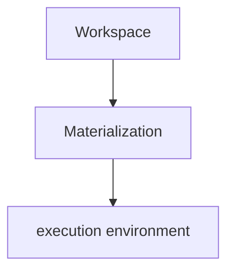

Destroying a Materialization must not inherently destroy the Workspace.

### 3.2 Workspace is not an agent Session

A ThinkPixelAR Session represents continuity of an agent interaction.

A ThinkPixelWS Workspace represents continuity of the work itself.

Multiple Sessions may sequentially or, where policy permits, concurrently interact with the same Workspace.

Example:

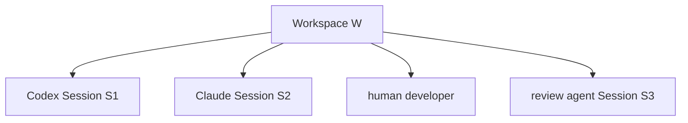

The Workspace can exist before and after all of them.

### 3.3 Membership is not authority

A Workspace may declare that the work context includes:

    GitHub repository A
    GitHub repository B
    SharePoint folder C
    Slack channel D
    browser profile E

This does not mean an actor may access all of those resources.

The invariant is:

    WorkspaceBinding != AccessGrant

and:

    Materialization != CapabilityGrant

ThinkPixelAG independently authorizes the subset that a governed Run may use.

### 3.4 Persistent state does not imply persistent credentials

Durable Workspace state must not require long-lived execution credentials to be stored inside it.

In particular, Workspace snapshots should not intentionally contain:

- model-provider API keys;
- GitHub tokens;
- Slack OAuth tokens;
- cloud access keys;
- Kubernetes credentials;
- short-lived Run credentials;
- ThinkPixelTG capability tokens;
- ThinkPixelLLMGW credentials.

Credentials are supplied at materialization/execution time through trusted mechanisms and are not part of Workspace identity.

### 3.5 Durable state and environment definition are separate

Persistent work state includes things such as:

- source files;
- documents;
- uncommitted edits;
- generated artifacts;
- selected application state.

Environment definition includes things such as:

- base OCI image;
- Dev Container;
- Devfile;
- ThinkPixel Runtime Profile;
- required applications.

Environment definition should be reproducible and declarative where possible.

Installing arbitrary software into a long-lived mutable root filesystem is not the preferred portability mechanism.

### 3.6 Application profiles require stronger treatment

Browser profiles, desktop profiles, and similar application-state stores may contain credential-equivalent data such as:

- cookies;
- localStorage;
- session tokens;
- SSO state;
- cached credentials.

They must not be treated as ordinary files merely because they can be represented as files.

Application-profile state uses an explicit profile abstraction with stronger authorization, encryption, retention, and audit requirements.

### 3.7 Multi-repository is first-class

A Workspace is not constrained to one source repository.

For example:

    /workspace/
      frontend/
      backend/
      infrastructure/
      shared-protos/
      docs/
      scratch/

Each component retains independent source provenance.

A Workspace generation represents the combined logical state across all components.

### 3.8 Immutable generations, mutable materializations

A Workspace has immutable committed generations.

A writable Materialization may temporarily contain dirty state.

Committing/checkpointing durable work produces a new generation.

Conceptually:

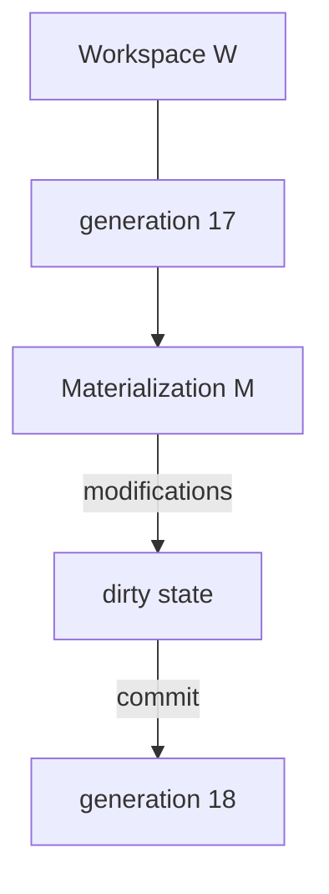

Generation history must never be rewritten silently.

### 3.9 Roaming is stronger than persistence

The terms are distinct.

**Persistent**

The work survives loss/replacement of the current compute instance.

**Portable**

The work can be reconstructed on different compatible infrastructure.

**Roaming**

The same Workspace identity can be materialized in another permitted execution location without changing its logical identity.

A local Kubernetes PVC may provide persistence without true roaming.

ThinkPixelWS must keep those concepts separate.

### 3.10 Forking is a first-class primitive

A Workspace can fork from an immutable generation.

Example:

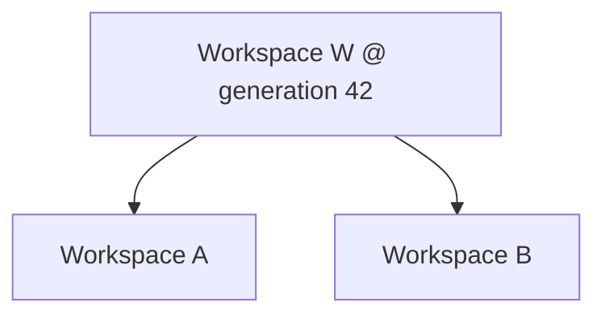

Forks must be independently writable.

A modification in Workspace A cannot alter Workspace B.

### 3.11 External systems remain external

A Slack channel, Jira project, SharePoint folder, Google Drive folder, GitHub repository, database, or SaaS application does not have to be physically copied into the Workspace.

ThinkPixelWS may represent these as logical external bindings.

The runtime chooses whether a binding is:

- materialized as content;
- mounted through a trusted provider;
- exposed as a live tool/integration reference.

### 3.12 Source import is not source write-back

For the initial release, importing source content into a Workspace does not imply permission to publish changes back to the source.

For example:

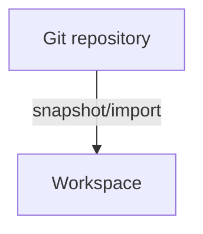

is separate from:

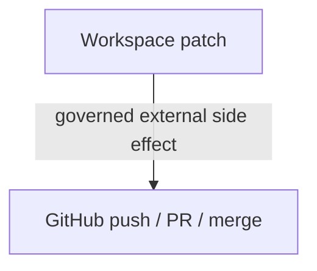

In a ThinkPixel deployment, write-back normally belongs through ThinkPixelTG and ThinkPixelAG.

---

## 4. Workspace composition model

A Workspace is a composite resource.

Conceptually:

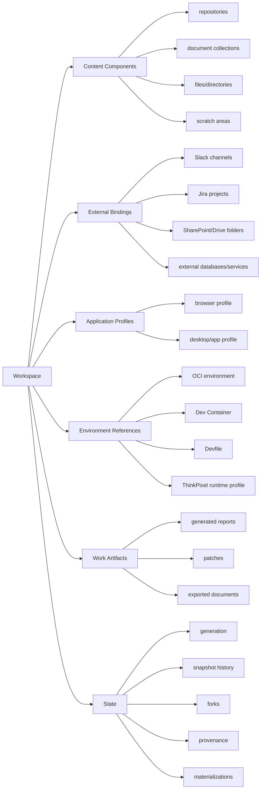

The Workspace Manifest describes logical composition rather than infrastructure-specific mounts.

---

## 5. Principal domain model

Initial domain entities:

- `Workspace`;
- `WorkspaceGeneration`;
- `WorkspaceComponent`;
- `ContentComponent`;
- `SourceBinding`;
- `ExternalBinding`;
- `ApplicationProfileBinding`;
- `EnvironmentBinding`;
- `ArtifactBinding`;
- `ComponentSnapshot`;
- `PortableSnapshot`;
- `Materialization`;
- `MaterializationLease`;
- `MaterializationCheckpoint`;
- `MaterializationPlan`;
- `WorkspaceFork`;
- `WorkspaceRetentionPolicy`;
- `WorkspaceAccessDecision`;
- `WorkspaceEvent`;
- `IdempotencyRecord`;
- `AuditEvent`;
- `OutboxMessage`.

### 5.1 Workspace

A Workspace minimally contains:

- ID;
- tenant;
- owner scope;
- name;
- description;
- classification;
- lifecycle state;
- current generation;
- concurrency policy;
- retention policy;
- creation/update timestamps.

### 5.2 WorkspaceGeneration

A WorkspaceGeneration is immutable after completion.

It records:

- generation number;
- parent generation;
- exact component set;
- exact component snapshot references;
- component provenance;
- environment references;
- binding metadata;
- created-by actor/Execution;
- creation timestamp;
- integrity digest.

### 5.3 WorkspaceComponent

Every component has:

- stable component ID;
- name;
- component kind;
- canonical mount/logical path where applicable;
- source/provenance;
- classification;
- trust/taint metadata;
- persistence class;
- materialization mode;
- immutable state reference for a generation.

### 5.4 Materialization

A Materialization represents a concrete, temporary realization of a Workspace generation on some execution/storage provider.

It contains:

- Materialization ID;
- Workspace ID;
- base generation;
- provider;
- target/placement;
- mode: read-only or writable;
- lease/fence where writable;
- provider-specific binding reference;
- lifecycle state;
- creation/expiry timestamps;
- latest checkpoint reference;
- dirty/clean state where known.

A Materialization is never the Workspace.

---

## 6. Workspace lifecycle

Initial Workspace lifecycle:

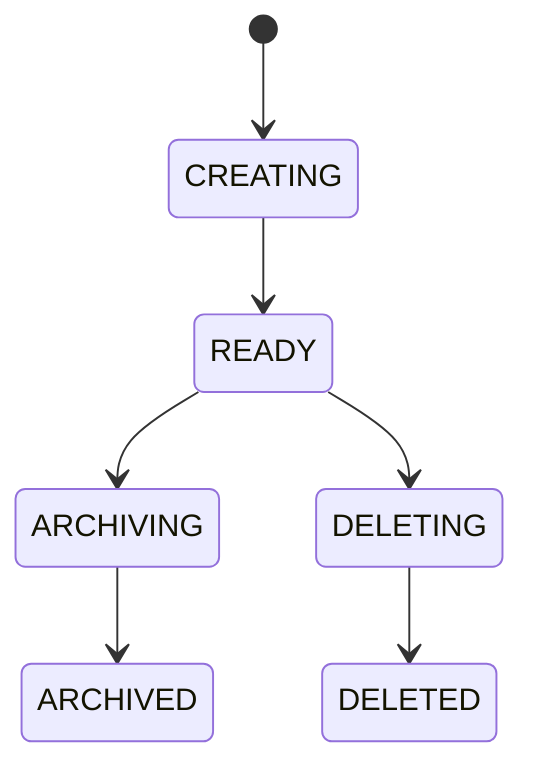

Additional degraded/error state may be included for incomplete provisioning/import.

Materialization lifecycle is separate:

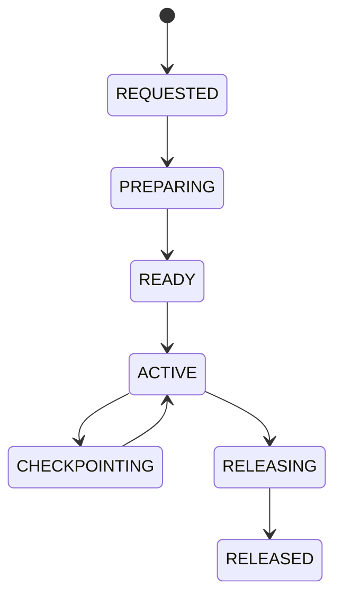

Any non-terminal stage may transition to a recoverable or failed state according to documented semantics.

Exact state machines are finalized in Phase 0.

---

## 7. Generation and commit model

Writable Workspace state uses explicit generation advancement.

The preferred invariant is:

> A completed WorkspaceGeneration is immutable.

A writable Materialization begins from:

    Workspace W generation N

and may later produce:

    Workspace W generation N+1

Commit requires an optimistic comparison against the expected Workspace head.

If another writer has advanced the Workspace unexpectedly, commit must not silently overwrite the new head.

Conflict policy may support:

- fail and require manual resolution;
- create fork;
- application-specific merge in future.

The first release should prefer fail/fork over invisible automatic merging.

---

## 8. Concurrency model

The default concurrency rule is:

> One writable Materialization may own the current Workspace head at a time.

Multiple read-only Materializations are permitted.

Writable access uses a lease plus monotonically increasing fencing token/epoch.

A stale Materialization cannot commit a new generation after its lease is lost or replaced.

Example:

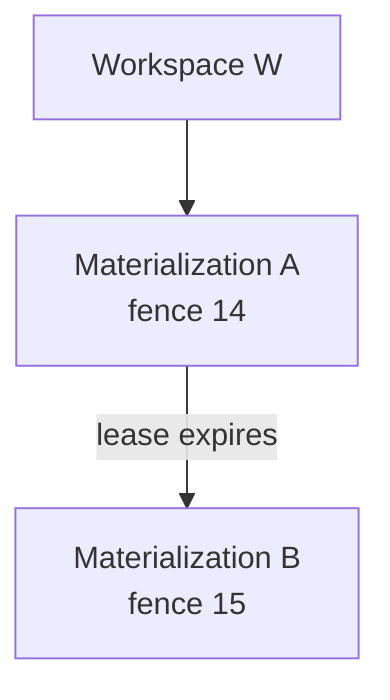

Materialization A must be unable to commit after fence 15 becomes current.

Parallel experimentation should normally use Workspace forks.

---

## 9. Workspace content kinds

Initial content-component kinds should support:

### Repository

A source-code repository or repository snapshot.

Metadata may include:

- source URI;
- provider;
- source revision;
- imported revision;
- branch/ref metadata;
- dirty state;
- provenance.

### Directory

A generic durable filesystem tree.

Useful for:

- project documents;
- working files;
- scratch state;
- generated reports.

### Document collection

A logical collection originating from systems such as:

- SharePoint;
- Google Drive;
- object storage;
- file shares.

The first release may materialize document collections as immutable/imported snapshots.

### Artifact collection

Outputs generated by agents or humans.

Artifact promotion/export remains distinct from Workspace membership.

---

## 10. External binding model

Not every contextual resource is physically stored in the Workspace.

`ExternalBinding` represents a logical resource such as:

- Slack workspace/channel;
- Teams channel;
- Jira project;
- issue tracker queue;
- SaaS application;
- database;
- observability system;
- SharePoint/Drive collection when used live;
- GitHub repository when used through live tools rather than file materialization.

An ExternalBinding contains descriptive metadata only.

It does not contain reusable credentials.

### 10.1 Binding modes

Initial modes:

- `materialized-copy`;
- `live-reference`;
- `profile-reference`;
- `environment-reference`.

### 10.2 Runtime behavior

ThinkPixelAG determines whether a Run may access the binding.

ThinkPixelTG normally provides live external access.

ThinkPixelWS provides the context reference.

Example:

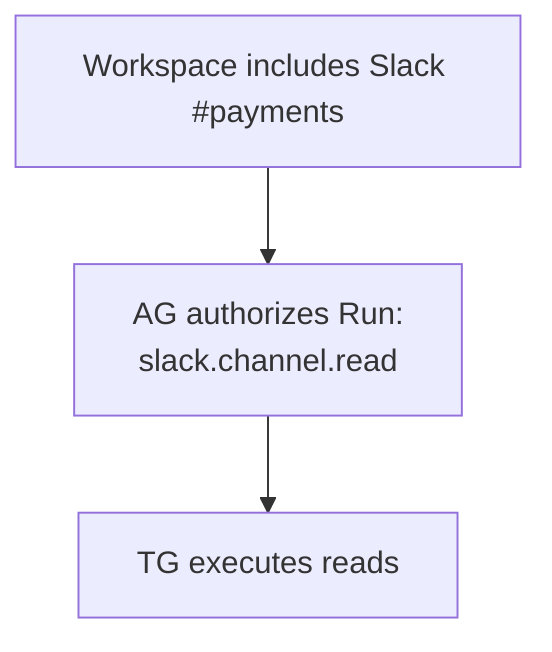

Workspace membership alone grants nothing.

---

## 11. Source providers

Define a source acquisition abstraction.

Conceptually:

    type SourceProvider interface {
        Resolve(ctx context.Context, spec SourceSpec) (ResolvedSource, error)
        Import(ctx context.Context, source ResolvedSource, target ImportTarget) (ImportResult, error)
        Refresh(ctx context.Context, binding SourceBinding) (RefreshPlan, error)
    }

Possible adapters:

- anonymous Git;
- uploaded archive;
- object-store artifact;
- ThinkPixelTG-governed SCM source;
- document-provider adapter;
- future enterprise connectors.

The integrated reference configuration should avoid placing GitHub/SharePoint/etc. credentials inside AR sandboxes.

---

## 12. Source synchronization

Source synchronization must be explicit.

Initial modes should include:

### Snapshot

Import exact source state once.

No automatic refresh.

### Refreshable snapshot

Workspace tracks upstream source identity and may explicitly refresh.

Refresh produces a new Workspace generation or fork.

### Live reference

Content stays external and is accessed through a tool/provider.

Bidirectional automatic synchronization is outside the first MVP.

Write-back to authoritative external systems is treated as a governed side effect rather than an implicit filesystem sync.

---

## 13. Content provenance

Every imported component should retain provenance sufficient to answer:

- where did this content come from?
- which source revision/version was used?
- when was it imported?
- which principal/Run requested the import?
- what derived content came from it?
- what classification applied?
- what source trust/taint applied?

Useful metadata includes:

    source
    source_type
    source_revision
    imported_at
    source_run_id
    initiating_principal
    classification
    source_trust
    taint
    derived_from

Provenance is immutable historical evidence associated with generations/components.

---

## 14. Classification, taint, and policy metadata

Workspace content can originate from untrusted sources.

The system should support labels such as:

- public;
- internal;
- confidential;
- restricted.

And trust/taint concepts such as:

- trusted-internal;
- authenticated-external;
- external-untrusted;
- high-taint.

ThinkPixelWS does not itself make all downstream policy decisions.

It preserves metadata so AG/GR/other trusted consumers can enforce policy.

A Workspace fork must preserve inherited provenance and classification.

---

## 15. Environment bindings

A Workspace can reference a reproducible environment definition.

Examples:

- OCI image digest;
- ThinkPixelMP artifact resolution;
- Dev Container specification;
- Devfile;
- ThinkPixelAR Runtime Profile;
- office/browser environment profile.

ThinkPixelWS records the reference.

It does not build or execute the environment itself.

ThinkPixelAR or another execution system materializes the environment.

### 15.1 Mutable environment state

Tools installed interactively into a running Materialization should not become the only durable representation of the environment.

Where environment changes should persist, they should preferably be:

- captured in a reproducible environment definition;
- promoted to an OCI artifact;
- or explicitly recorded as non-portable Materialization state.

---

## 16. Dev Container and Devfile interoperability

The first release should evaluate import/reference support for:

- `devcontainer.json`;
- Devfile.

The goal is interoperability, not replacing either standard.

ThinkPixelWS may extract:

- project layout;
- required volumes;
- environment references;
- tool/application requirements.

Infrastructure-sensitive fields are normalized and subject to trusted policy rather than blindly reproduced.

---

## 17. Application profiles

Define:

    type ProfileProvider interface {
        Resolve(ctx context.Context, ref ProfileRef) (ProfileMetadata, error)
        Materialize(ctx context.Context, ref ProfileRef, grant ProfileGrant, target Target) (ProfileHandle, error)
        Checkpoint(ctx context.Context, handle ProfileHandle) (ProfileCheckpoint, error)
        Release(ctx context.Context, handle ProfileHandle) error
    }

Application-profile examples:

- browser profile;
- office application profile;
- desktop user profile;
- IDE personalization profile.

### 17.1 Credential-adjacent state

Profiles containing authentication/session state must be treated as sensitive credentials-adjacent assets.

Requirements include:

- encryption at rest;
- strong access control;
- tenant isolation;
- explicit Materialization authority;
- audit;
- no casual export;
- no inclusion in ordinary Workspace archives;
- short-lived profile access grants;
- configurable retention;
- secure deletion.

### 17.2 Browser profile

A browser profile may contain:

- cookies;
- localStorage;
- IndexedDB;
- bookmarks;
- settings;
- extensions;
- authenticated web sessions.

Loading such a profile effectively grants access to the identities represented by those sessions.

Therefore:

    BrowserProfileRef != BrowserAccessGrant

The first release may implement only the provider seam and a controlled reference backend if full browser-profile portability is not mature enough for safe RC inclusion.

---

## 18. Materialization architecture

ThinkPixelWS materializes Workspace state into execution surfaces through a provider abstraction.

Conceptually:

    type MaterializationProvider interface {
        Prepare(ctx context.Context, req MaterializationRequest) (MaterializationHandle, error)
        Status(ctx context.Context, handle MaterializationHandle) (MaterializationStatus, error)
        Checkpoint(ctx context.Context, handle MaterializationHandle) (ProviderCheckpoint, error)
        Restore(ctx context.Context, req RestoreRequest) (MaterializationHandle, error)
        Release(ctx context.Context, handle MaterializationHandle) error
    }

Possible future targets include:

- Kubernetes CSI/PVC;
- local filesystem;
- VM-attached disk;
- cloud workstation volume;
- Windows profile/disk;
- browser environment.

The first production implementation targets Kubernetes.

Provider-specific types do not enter the core domain.

---

## 19. Kubernetes materialization

The initial Kubernetes implementation should use existing primitives rather than create a custom Workspace CRD/operator unless a demonstrated need appears.

Potential primitives include:

- PersistentVolumeClaim;
- VolumeSnapshot;
- CSI clone;
- object-store restore;
- Kubernetes Agent Sandbox volume attachment.

ThinkPixelWS should produce an AR-consumable materialization/binding result without requiring AR to understand Workspace storage internals.

Conceptually:

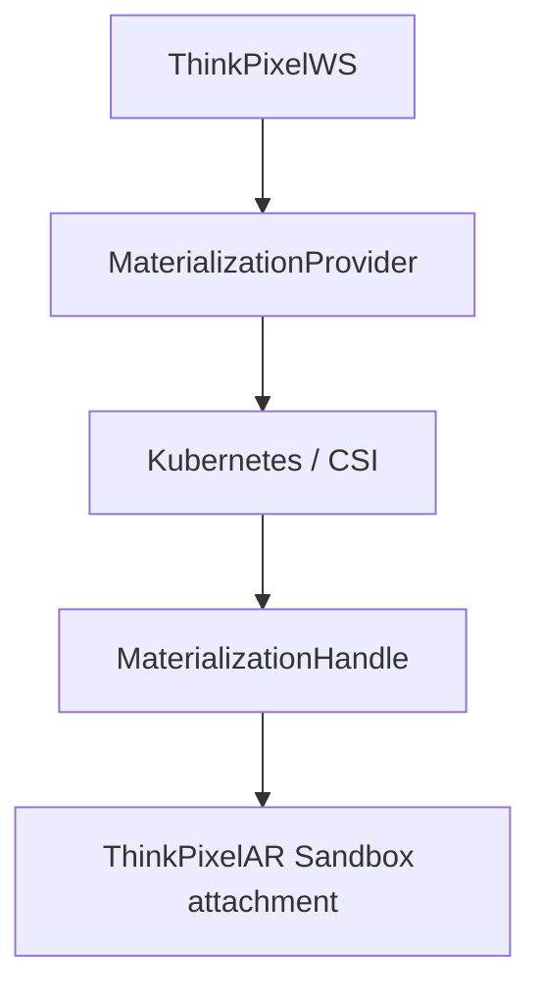

---

## 20. Hot storage vs portable state

The architecture should distinguish high-performance local working storage from portable canonical state.

Conceptually:

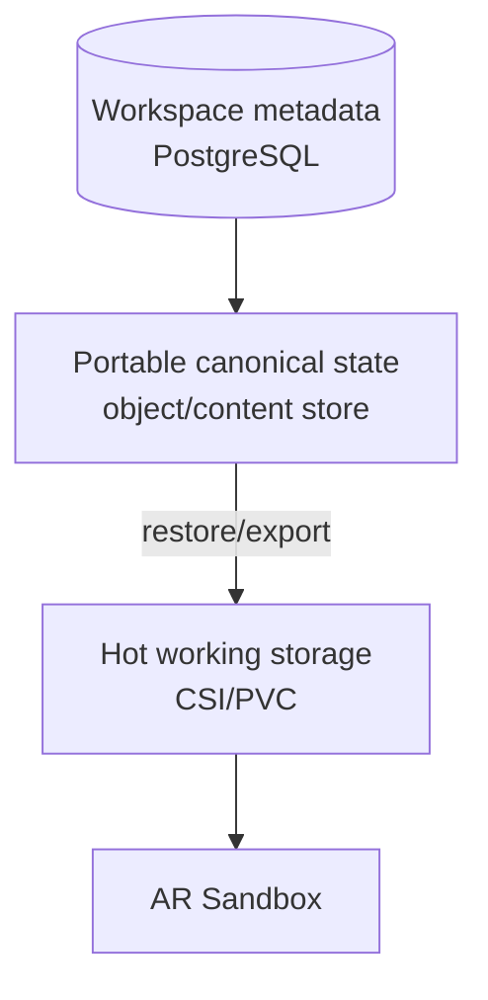

The exact portable-snapshot implementation is selected during Phase 0/benchmarking.

Candidate approaches may include:

- provider-native snapshots plus export;
- content-addressed chunk storage;
- established backup/snapshot technology;
- object-store bundle format.

ThinkPixelWS should avoid inventing a bespoke distributed filesystem.

---

## 21. Portable snapshot model

A `PortableSnapshot` is an infrastructure-independent representation sufficient to reconstruct Workspace content on another compatible storage provider.

It should include:

- Workspace ID;
- generation;
- component manifest;
- content hashes;
- component snapshot references;
- provenance;
- classification;
- environment/profile references;
- creation time;
- integrity digest;
- encryption/key metadata reference;
- format/version.

Portable snapshots must not contain long-lived execution credentials.

### 21.1 Snapshot integrity

Restoration verifies:

- manifest digest;
- component hashes;
- expected sizes;
- format version;
- tenant/workspace ownership;
- encryption/key identity;
- classification/residency policy.

---

## 22. Snapshot, checkpoint, and generation semantics

These terms are distinct.

### Materialization checkpoint

Provider-local durability point for an active working Materialization.

Useful for crash recovery.

May not be portable.

### Portable snapshot

Provider-independent durable representation.

Useful for roaming, archive, and disaster recovery.

### Workspace generation

Logical immutable committed Workspace state.

A generation may reference one or more portable/provider snapshots.

The first release must document when a Workspace head becomes durable according to each level.

---

## 23. Recovery semantics

The system must define behavior for:

- WS API crash;
- worker crash;
- PostgreSQL interruption;
- Materialization provider failure;
- PVC loss;
- node loss;
- AR sandbox loss;
- object-store outage;
- checkpoint failure;
- portable snapshot failure;
- commit race;
- expired writable lease;
- stale writer returning after takeover.

A Workspace remains valid if a Materialization disappears.

Dirty, uncommitted state may have a documented RPO depending on the last successful checkpoint.

Recovery state must be observable rather than silently discarding work.

---

## 24. Forking

Forking creates a new Workspace identity whose initial generation references an existing immutable generation.

Preferred behavior uses copy-on-write provider primitives where available.

Conceptually:

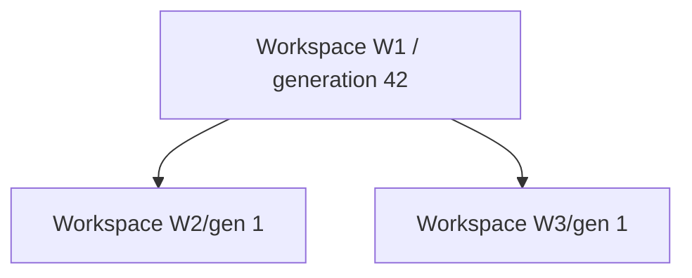

Fork operations preserve:

- provenance;
- classification;
- parent relationship;
- environment refs;
- source refs.

Application-profile bindings should not automatically fork sensitive authenticated profiles unless explicitly allowed.

---

## 25. Roaming and placement

ThinkPixelWS itself should not be the global compute scheduler.

A MaterializationRequest specifies a target context supplied by AR/operator policy.

WS determines whether Workspace state can legally and technically be materialized there.

Checks may include:

- data residency;
- classification;
- storage provider compatibility;
- encryption/key availability;
- application-profile availability;
- required architecture;
- source locality;
- snapshot format support.

### 25.1 Residency

A confidential Workspace stored in EU-only storage must not silently roam to a US execution cell.

Placement authorization is evaluated before moving content.

### 25.2 Locality optimization

Where multiple valid targets exist, AR/scheduler may prefer a location that already contains:

- hot materialization;
- cached portable snapshot;
- source data.

WS exposes locality hints but does not own global compute scheduling.

---

## 26. Workspace access authority

ThinkPixelWS needs authorization for its own administrative/user operations.

Examples:

- create Workspace;
- view Workspace;
- fork;
- delete;
- archive;
- request Materialization;
- read sensitive profile metadata.

This is distinct from Run authority.

Define a typed `WorkspaceAuthorizer` port.

The reference implementation may use OPA/Rego.

For ThinkPixel-integrated materializations, an additional `ExecutionAuthorityVerifier` validates the AG-issued execution context.

The two questions remain separate:

    "May Alice administer Workspace W?"

and:

    "May Run R access component C of Workspace W?"

---

## 27. ThinkPixelAG integration

The preferred integrated flow is:

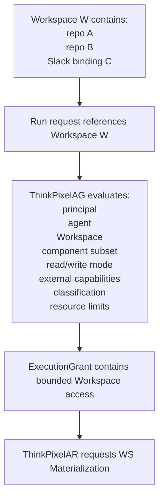

ThinkPixelWS validates that the requested Materialization is within the issued grant.

It cannot expand the component set or write mode.

---

## 28. ThinkPixelAR integration

ThinkPixelAR owns:

- Session;
- Execution;
- Attempt;
- Sandbox;
- harness state.

ThinkPixelWS owns:

- Workspace;
- generations;
- materializations;
- snapshots;
- forks.

AR retains only a Workspace binding such as:

    workspace_id
    generation
    materialization_id
    access_mode
    mount/materialization handle

AR does not become the canonical Workspace database.

### 28.1 Session independence

Closing an AR Session does not automatically delete its Workspace.

Workspace retention is explicit.

### 28.2 Sandbox loss

If an AR sandbox disappears:

- WS Materialization may remain;
- AR may attach a replacement sandbox;
- or WS may restore/recreate Materialization from checkpoint/generation.

---

## 29. ThinkPixelTG integration

External enterprise data should normally enter the Workspace through governed source operations.

Example:

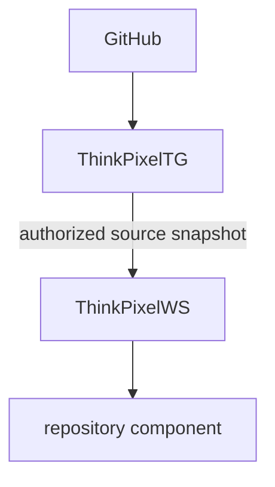

The agent receives code.

The agent does not receive a reusable GitHub credential.

Similarly, external write-back flows through TG rather than being implied by Workspace persistence.

ThinkPixelWS may expose source/export operations as TG capabilities where appropriate.

---

## 30. ThinkPixelMP integration

Reusable Workspace environment definitions may reference immutable Marketplace artifacts.

Examples:

- development environment OCI image;
- browser/office environment package;
- toolchain bundle;
- Workspace template.

ThinkPixelWS should store exact MP resolution/digest references rather than mutable `latest` tags for reproducible environments.

MP qualifies the software definition.

WS stores the work state.

AR executes the environment.

---

## 31. Workspace templates

A WorkspaceTemplate may describe reusable structure without containing tenant work data.

Example:

    payments-service-development

      components:
        frontend repository
        backend repository
        infrastructure repository
        docs directory

      environment:
        engineering-go-node

      bindings:
        Jira project placeholder
        Slack channel placeholder

Templates are not required for the first MVP but the schema should allow future support.

A template is not a Workspace instance.

ThinkPixelMP may eventually distribute templates.

---

## 32. API contract

REST/JSON with OpenAPI 3.1 is canonical for the release candidate.

Use:

- RFC 7807 problem details;
- OIDC/JWT authentication;
- UUIDv7;
- UTC timestamps;
- W3C trace context;
- bounded payloads;
- cursor pagination;
- mutation `Idempotency-Key`;
- SSE for ordered Workspace events.

### 32.1 Workspace API

Candidate endpoints:

    POST   /v1/workspaces
    GET    /v1/workspaces
    GET    /v1/workspaces/{workspace_id}
    DELETE /v1/workspaces/{workspace_id}

### 32.2 Component API

Candidate endpoints:

    GET  /v1/workspaces/{workspace_id}/components
    POST /v1/workspaces/{workspace_id}/components
    GET  /v1/workspaces/{workspace_id}/components/{component_id}

Component mutation may be implemented as generation-producing operations rather than mutable CRUD.

### 32.3 Generation API

Candidate endpoints:

    GET /v1/workspaces/{workspace_id}/generations
    GET /v1/workspaces/{workspace_id}/generations/{generation}

### 32.4 Materialization API

Candidate endpoints:

    POST   /v1/workspaces/{workspace_id}/materializations
    GET    /v1/materializations/{materialization_id}
    POST   /v1/materializations/{materialization_id}/checkpoint
    POST   /v1/materializations/{materialization_id}/commit
    DELETE /v1/materializations/{materialization_id}

### 32.5 Snapshot/fork API

Candidate endpoints:

    POST /v1/workspaces/{workspace_id}/snapshots
    GET  /v1/workspaces/{workspace_id}/snapshots

    POST /v1/workspaces/{workspace_id}/forks

### 32.6 Source API

Candidate endpoints:

    POST /v1/workspaces/{workspace_id}/imports
    GET  /v1/imports/{import_id}

    POST /v1/workspaces/{workspace_id}/refreshes

### 32.7 Lifecycle

Candidate endpoints:

    POST /v1/workspaces/{workspace_id}/archive
    POST /v1/workspaces/{workspace_id}/restore

### 32.8 Events

    GET /v1/workspaces/{workspace_id}/events

The exact API is finalized in Phase 0.

---

## 33. Workspace Manifest

A portable declarative representation should be defined.

Illustrative shape:

    apiVersion: workspace.thinkpixel.io/v1alpha1
    kind: Workspace

    metadata:
      name: payments-modernization

    components:
      - name: frontend
        kind: repository
        path: /workspace/frontend
        source:
          ref: scm://github/acme/payments-ui
          mode: snapshot

      - name: backend
        kind: repository
        path: /workspace/backend
        source:
          ref: scm://github/acme/payments-api
          mode: snapshot

      - name: project-documents
        kind: document-collection
        path: /workspace/docs
        source:
          ref: documents://sharepoint/payments
          mode: snapshot

    externalBindings:
      - name: team-chat
        kind: collaboration
        ref: collaboration://slack/acme/payments
        mode: live-reference

    applicationProfiles:
      - name: corporate-browser
        kind: browser
        ref: profile://browser/alice/payments

    environment:
      ref: mp://environments/engineering-standard@sha256:...

The Manifest contains references and requirements.

It does not contain credentials.

---

## 34. Persistence responsibilities

PostgreSQL is mandatory and authoritative for WS control metadata.

It stores:

- Workspaces;
- generations;
- component metadata;
- source bindings;
- external bindings;
- profile references;
- environment refs;
- provenance;
- classification/taint;
- materializations;
- leases/fences;
- checkpoints;
- portable snapshot metadata;
- forks;
- retention/lifecycle state;
- idempotency;
- audit;
- outbox.

Large Workspace content does not live in PostgreSQL.

Storage backends hold content.

---

## 35. Storage provider architecture

Define narrow ports rather than one giant storage abstraction.

Expected ports may include:

### WorkingStorageProvider

Provides high-performance writable Materializations.

### SnapshotProvider

Provides provider-native checkpoints/snapshots.

### PortableStore

Stores portable Workspace snapshots/content.

### ProfileProvider

Stores/materializes sensitive application profiles.

### SourceProvider

Imports external content.

This separation permits different infrastructure for different classes of state.

---

## 36. Encryption and key management

Workspace content is enterprise data.

Production deployments must support encryption at rest.

Define a `KeyProvider` abstraction for:

- Workspace snapshot encryption keys;
- sensitive Profile state;
- portable export encryption.

Requirements include:

- tenant/workspace key context;
- external KMS/HSM integration seam;
- key rotation;
- no raw keys in PostgreSQL;
- no raw keys in logs/events;
- restore behavior when key unavailable;
- crypto-shredding considerations for deletion where applicable.

Provider-native disk encryption may supplement but not replace portable-snapshot encryption requirements where snapshots leave the storage domain.

---

## 37. Secret persistence prevention

ThinkPixelWS cannot guarantee that users or agents never write secrets into ordinary files.

However, the architecture must avoid platform-caused persistence.

Requirements include:

- execution credentials mounted outside Workspace paths;
- no credential environment export into snapshot manifests;
- explicit profile separation;
- exclusion lists for known platform credential paths;
- optional secret-scanning hook before portable export;
- audit warning on discovered high-confidence credentials;
- documented residual risk.

A secret-scanner integration is a port/evidence source, not a reason to build a secret scanner into WS.

---

## 38. Retention, archive, and deletion

Workspaces require explicit lifecycle governance.

Retention policy may include:

- idle TTL;
- archive after inactivity;
- snapshot retention;
- maximum generations;
- legal hold;
- delete-after;
- profile retention.

Archive should permit releasing expensive hot storage while retaining portable canonical state.

Delete is asynchronous and auditable.

Deletion must account for:

- hot Materializations;
- provider snapshots;
- portable snapshots;
- application profiles;
- indexes/caches;
- encryption keys;
- external references.

External authoritative source data is not deleted merely because a Workspace reference is deleted.

---

## 39. Idempotency

Mutation APIs accept `Idempotency-Key`.

Important idempotent operations include:

- Workspace creation;
- component import;
- Materialization creation;
- checkpoint;
- commit;
- fork;
- portable snapshot;
- archive;
- restore;
- delete.

Keys are scoped by:

- tenant;
- principal;
- route/action;
- normalized request digest.

Duplicate requests return the established result.

---

## 40. Audit and events

Security-sensitive state mutations commit AuditEvent and OutboxMessage records transactionally.

Events may include:

- Workspace created;
- component imported;
- generation committed;
- Materialization created;
- writable lease acquired/lost;
- checkpoint completed;
- portable snapshot completed;
- Workspace forked;
- Workspace roamed/restored;
- classification changed;
- profile materialized;
- Workspace archived/deleted.

Outbox delivery is at least once.

Event IDs support consumer idempotency.

---

## 41. Go implementation approach

Use a supported pinned Go release.

Expected repository structure:

    cmd/
      thinkpixelws/
      migrate/
      thinkpixelwsctl/

    api/
      openapi/
      schemas/

    internal/
      domain/
        workspace/
        generation/
        component/
        materialization/
        snapshot/
        fork/
        provenance/

      app/
        workspace/
        materialization/
        checkpoint/
        commit/
        import/
        roaming/
        lifecycle/

      ports/
        authorization/
        workingstorage/
        snapshot/
        portable/
        source/
        profile/
        key/
        policy/
        clock/

      adapters/
        authorization/
          local/
          thinkpixelag/

        workingstorage/
          kubernetes/

        snapshot/
          csi/

        portable/
          objectstore/

        source/
          archive/
          git/
          thinkpixeltg/

        profile/
          browser/

        policy/
          opa/

        postgres/
        http/
        oidc/
        key/

      telemetry/
      security/

    migrations/

    deploy/
      helm/

    docs/
      adr/
      contracts/

    test/
      integration/
      storage/
      security/
      e2e/
      roaming/
      chaos/

`internal/domain` must not import:

- Kubernetes packages;
- CSI types;
- S3 SDK types;
- GitHub APIs;
- Slack APIs;
- browser-provider SDKs;
- ThinkPixelAG transport types;
- ThinkPixelTG transport types;
- PostgreSQL drivers;
- HTTP framework types.

Those are adapters.

---

## 42. CLI

`thinkpixelwsctl` should eventually support workflows such as:

    workspace create
    workspace describe
    workspace list

    component list
    component import

    materialization create
    materialization status
    materialization checkpoint
    materialization commit
    materialization release

    workspace snapshot
    workspace fork

    workspace archive
    workspace restore

The CLI calls the API rather than bypassing server policy.

---

## 43. Observability

Use:

- structured logs;
- Prometheus metrics;
- OpenTelemetry traces.

Canonical correlation fields:

    tenant
    workspace_id
    generation
    component_id
    materialization_id
    execution_id
    run_id
    provider
    target
    request_id
    trace_id

Initial metrics should include:

- Workspace counts by lifecycle;
- Workspace creation rate/failure;
- generations committed;
- Materializations by state;
- Materialization creation latency;
- writable lease conflicts;
- stale fence rejections;
- checkpoint latency/failure;
- portable snapshot latency/failure;
- snapshot bytes;
- restore latency;
- fork latency;
- import latency/failure;
- storage usage;
- profile materialization;
- residency denials;
- orphaned Materializations;
- outbox lag;
- PostgreSQL pool health;
- provider error/latency.

Logs/traces must not automatically contain Workspace file contents, browser cookies, source credentials, or execution secrets.

---

## 44. Security model

Assume hostile:

- imported repositories;
- documents;
- archives;
- symlinks;
- filenames;
- generated files;
- source metadata;
- profile state;
- agents manipulating Workspace contents;
- external source systems;
- compromised Materializations.

### 44.1 Path safety

Materialization/import code must prevent:

- path traversal;
- absolute-path escape;
- symlink escape;
- hardlink escape;
- special device creation;
- mount-point overwrite;
- cross-component path collision.

### 44.2 Tenant isolation

One tenant cannot:

- reference another tenant's Workspace;
- access another tenant's snapshots;
- materialize another tenant's profile;
- derive storage handles through enumeration;
- reuse another tenant's decryption context.

### 44.3 Stale writers

Lost/expired writers are fenced.

A stale Materialization cannot:

- commit;
- advance head;
- publish checkpoint as current;
- delete newer state.

### 44.4 Profile security

Credential-adjacent profile state receives stronger controls than normal Workspace files.

### 44.5 Data residency

Portable snapshot transfer must respect configured data-residency policy.

### 44.6 Infrastructure metadata

Workspace Manifests cannot grant:

- privileged container mode;
- host mounts;
- unrestricted network;
- Kubernetes service-account credentials;
- profile access;
- external credentials.

Those are trusted control-plane decisions.

---

## 45. Testing strategy

### Unit tests

Cover:

- state machines;
- generation immutability;
- head advancement;
- lease/fence semantics;
- fork lineage;
- component path validation;
- provenance inheritance;
- classification handling;
- retention logic;
- residency decisions.

### Property/fuzz tests

Cover:

- path normalization;
- generation graphs;
- component manifests;
- concurrent commits;
- snapshot manifests;
- Workspace Manifest parsing;
- archive handling;
- source metadata.

### PostgreSQL integration tests

Use real pinned PostgreSQL.

Cover:

- migrations;
- tenant isolation;
- generation monotonicity;
- concurrent head commits;
- lease/fencing;
- idempotency;
- fork ancestry;
- audit/outbox;
- rollback.

### Storage tests

Use real disposable provider environments.

Cover:

- create/attach/release;
- checkpoint;
- snapshot;
- restore;
- clone;
- provider outage;
- corrupt snapshot;
- capacity failure.

### Security tests

Cover:

- malicious archives;
- path traversal;
- symlink/hardlink escape;
- cross-component path collision;
- tenant enumeration;
- stale writer;
- credential persistence;
- profile leakage;
- unauthorized roaming;
- data-residency violation.

### End-to-end tests

Reference coding flow:

1. create Workspace;
2. import three repositories;
3. create generation;
4. materialize into Kubernetes;
5. attach AR sandbox;
6. modify multiple repositories;
7. checkpoint;
8. commit generation;
9. destroy compute;
10. restore/materialize again;
11. verify exact content;
12. fork;
13. modify both forks independently.

Reference office flow, where supported:

1. create Workspace;
2. import document collection;
3. add live collaboration binding;
4. attach browser/profile reference;
5. materialize into office/browser-capable environment;
6. update documents;
7. persist Workspace generation;
8. destroy compute;
9. restore work context.

### Chaos tests

Deliberately:

- kill WS worker;
- restart WS API;
- kill AR sandbox;
- delete Pod;
- lose node;
- interrupt checkpoint;
- interrupt portable snapshot;
- interrupt commit;
- expire writer lease;
- reintroduce stale Materialization;
- interrupt object store;
- interrupt PostgreSQL;
- corrupt local hot state.

The system must either recover or expose a safe, diagnosable state.

---

## 46. MVP definition

The first useful MVP focuses on coding Workspace semantics.

It demonstrates:

1. private Kubernetes deployment;
2. PostgreSQL metadata;
3. multi-repository Workspace;
4. immutable Workspace generations;
5. Kubernetes/CSI writable Materialization;
6. one-writer lease/fencing;
7. repository/directory components;
8. source provenance;
9. checkpoint;
10. commit;
11. compute destruction;
12. Materialization recreation;
13. Workspace fork;
14. AR integration;
15. AG-scoped Workspace access where integrated.

The first MVP does not require full browser-profile roaming or cross-cloud migration.

---

## 47. Release-candidate defining proof

The release candidate should additionally prove actual portability.

The defining scenario is:

> A Workspace containing several repositories and project documents is modified in one isolated execution environment, committed to an immutable generation, its original compute and hot working storage are removed, and the exact same Workspace generation is reconstructed on a different compatible execution/storage target. A fork can then diverge independently. No stale execution authority or platform credentials are carried as part of the Workspace.

Where practical, RC evidence should include two independent Kubernetes/storage environments rather than only two Pods sharing the same PVC backend.

---

## 48. Delivery phases and exit gates

### Phase 0 — Decisions, threats, and contracts

Define:

- product boundary;
- glossary;
- threat model;
- Workspace/Generation/Materialization semantics;
- component taxonomy;
- source and external binding models;
- profile security model;
- environment bindings;
- concurrency/fencing;
- snapshot/checkpoint/generation distinction;
- portable snapshot architecture;
- first WorkingStorageProvider;
- first PortableStore;
- roaming definition;
- residency policy;
- AR/AG/TG integration contracts;
- Workspace Manifest;
- OpenAPI;
- storage/security limits;
- supported versions.

Exit when no ambiguity remains around canonical Workspace state, authority, write ownership, durability levels, profile treatment, or roaming semantics.

### Phase 1 — Engineering foundation

Initialize:

- Go;
- repository structure;
- configuration;
- logging;
- metrics;
- tracing;
- HTTP baseline;
- CLI skeleton;
- PostgreSQL;
- migration command;
- Makefile;
- CI;
- baseline image;
- OpenAPI validation.

Exit when clean checkout verification succeeds.

### Phase 2 — Durable Workspace domain

Implement:

- Workspace;
- generations;
- components;
- provenance;
- bindings;
- lifecycle;
- idempotency;
- audit;
- outbox;
- OIDC;
- administrative authorization.

Exit when PostgreSQL tests prove tenant isolation, immutable generations, concurrency, and lifecycle behavior.

### Phase 3 — Kubernetes working Materializations

Implement:

- MaterializationProvider;
- Kubernetes/CSI backend;
- writable leases/fencing;
- attach/release;
- provider checkpoints;
- orphan reconciliation;
- path/component layout.

Exit when multi-component Workspaces survive sandbox/Pod replacement using persistent hot storage.

### Phase 4 — Source import and multi-repository MVP

Implement:

- SourceProvider;
- archive/public Git source;
- ThinkPixelTG governed source seam;
- repository components;
- directories;
- provenance;
- safe imports;
- explicit refresh semantics.

Exit when three independent repositories can be imported and materialized into one deterministic Workspace tree.

### Phase 5 — Generations, commit, snapshot, and fork

Implement:

- commit;
- generation advancement;
- optimistic head;
- stale-writer rejection;
- provider snapshots;
- fork;
- copy-on-write where available.

Exit when concurrent/stale writers cannot lose work silently and forks diverge independently.

### Phase 6 — Portable state and roaming

Implement:

- PortableStore;
- portable snapshot format;
- encryption;
- export;
- restore;
- cross-storage restore;
- residency checks;
- archive.

Exit when committed Workspace state can be reconstructed without dependence on the original hot volume.

This is the first true ThinkPixelWS milestone.

### Phase 7 — ThinkPixel integrated MVP

Implement:

- ThinkPixelAG execution access verification;
- ThinkPixelAR WorkspaceBinding;
- ThinkPixelTG governed source import;
- exact component subsets;
- read-only vs writable access;
- cancellation/lease cleanup;
- integrated telemetry.

Exit when an AG-governed AR Execution can consume and update a WS Workspace without acquiring raw source-system credentials.

### Phase 8 — External bindings, environment interoperability, and profiles

Implement:

- ExternalBinding;
- Dev Container/Devfile references/import;
- environment references;
- browser/application ProfileProvider contract;
- controlled browser-profile backend if safe;
- profile-specific encryption/audit;
- office-work reference flow where practical.

Exit when non-filesystem work context can be represented without treating external membership as authority.

### Phase 9 — Roaming, security, performance, and resilience hardening

Implement/verify:

- second storage/execution target;
- actual cross-target restore;
- snapshot dedup/caching where justified;
- large Workspace behavior;
- source refresh conflicts;
- chaos;
- hostile archives;
- credential-residue tests;
- profile residue tests;
- data-residency enforcement;
- capacity limits.

Exit when the roaming claim is backed by reproducible evidence.

### Phase 10 — Production packaging and operations

Complete:

- Helm chart;
- migrations;
- RBAC;
- NetworkPolicies;
- dashboards;
- alerts;
- SLOs;
- runbooks;
- backup/restore;
- retention/deletion;
- upgrade/rollback;
- security scans;
- SBOM/provenance;
- release automation.

Exit when a production-like deployment passes lifecycle and disaster-recovery exercises.

### Phase 11 — Release-candidate closure

Freeze contracts.

Run full gates.

Resolve critical/high findings.

Reconcile plan/TODO.

Create ADRs.

Document limitations.

Remove implementation planning files only after durable rationale is preserved.

Exit when one exact commit produces traceable release artifacts and the defining roaming proof passes.

---

## 49. Explicit post-RC scope

The following should not block the first RC:

- general distributed filesystem;
- collaborative real-time filesystem editing;
- automatic Git merge engine;
- automatic push/PR creation;
- full Windows desktop persistence implementation;
- own browser automation service;
- arbitrary VDI infrastructure;
- public Workspace sharing marketplace;
- cross-enterprise Workspace federation;
- sophisticated semantic Workspace search;
- cognitive memory;
- application-specific merge algorithms;
- multi-master writable Workspace replication;
- transparent global POSIX filesystem;
- automatic environment-image building;
- direct SaaS credential brokerage duplicating ThinkPixelTG.

---

## 50. Coding-agent operating instructions

1. Read `README.md`, this file, and `TODO.md`; inspect repository status before editing.
2. Preserve unrelated user changes.
3. Select the first unchecked TODO whose dependencies are complete.
4. Work on one atomic item or tightly coupled contiguous group.
5. Restate acceptance criteria internally before implementation.
6. Identify tests before coding.
7. If implementation invalidates an architectural assumption, update this plan in the same change.
8. Implement tests, migrations, schemas, security behavior, telemetry, and documentation required by the item.
9. Run narrow tests while developing.
10. Run item-specific acceptance commands before checking an item.
11. Run `make verify` before declaring a phase complete.
12. A checkbox means implemented and verified.
13. Record completion date, commit, and evidence in `TODO.md`.
14. Never equate Workspace membership with authorization.
15. Never store execution credentials intentionally in Workspace canonical state.
16. Never make a PVC ID part of Workspace public identity.
17. Never silently mutate a completed WorkspaceGeneration.
18. Never permit a stale Materialization to commit.
19. Never allow Workspace Manifest metadata to grant privileged runtime configuration.
20. Never fork/copy credential-bearing application profiles without explicit authorization.
21. Never perform implicit source-system write-back.
22. Never silently move classified data across residency boundaries.
23. Never commit test Workspace contents, browser profiles, tokens, kubeconfigs, source credentials, or encryption keys to Git.
24. Released migrations are immutable.
25. Update README when user-visible API, security, storage, compatibility, or deployment behavior changes.
26. Archive phase evidence under `docs/`.
27. Commit only proven work.

---

## 51. ADR transition

Expected ADRs include:

- Workspace service boundary;
- Workspace vs Session;
- Workspace vs Materialization;
- immutable generations;
- one-writer fencing;
- multi-repository model;
- external binding semantics;
- Workspace membership != authority;
- source import vs write-back;
- provenance/taint model;
- WorkingStorageProvider;
- portable snapshot architecture;
- snapshot vs checkpoint vs generation;
- Kubernetes/CSI materialization;
- roaming definition;
- residency policy;
- application-profile security;
- browser-profile treatment;
- EnvironmentBinding;
- Dev Container/Devfile interoperability;
- AG integration;
- AR WorkspaceBinding;
- TG source integration;
- encryption/key management;
- secret persistence prevention;
- retention/archive/delete.

At RC closure:

1. reconcile the plan with implementation;
2. preserve durable rationale and rejected alternatives;
3. record meaningful deviations and lessons;
4. transfer stable behavior to ADRs/permanent documentation;
5. verify no unresolved security/storage risk is hidden;
6. remove `PLAN.md` and `TODO.md`;
7. run documentation/link/full verification;
8. build release artifacts from the exact resulting commit.

---

## 52. Release-candidate quality gate

An RC requires:

- every required TODO item completed with evidence;
- clean build;
- unit tests;
- race tests;
- property/fuzz tests;
- real PostgreSQL integration tests;
- real Kubernetes/CSI tests;
- portable snapshot tests;
- cross-target restore tests;
- AG integration tests;
- AR integration tests;
- TG source integration tests;
- path/archive security tests;
- stale-writer/fencing tests;
- tenant-isolation tests;
- credential-residue tests;
- profile-security tests where implemented;
- residency-policy tests;
- chaos/recovery tests;
- migration tests;
- install/upgrade/rollback tests;
- backup/restore evidence;
- load/capacity evidence;
- no unresolved critical/high vulnerability;
- no undocumented fail-open authority path;
- no required flaky/skipped tests;
- service image digest;
- SBOM/provenance;
- supported-version matrix;
- documented known limitations;
- ADRs matching implementation.

The final proof demonstrates:

> **A durable multi-component work context can be materialized into disposable compute, modified under bounded authority, committed into an immutable generation, reconstructed on different compatible infrastructure, and forked independently without carrying stale execution authority or coupling Workspace identity to any machine, volume, agent Session, or cloud.**
