# ThinkPixelWS

ThinkPixelWS is an open-source, vendor-neutral **Workspace Service for durable, portable, and roaming AI-agent work contexts**.

It provides persistent multi-repository workspaces, immutable workspace generations, temporary materializations, snapshots, forks, source provenance, external-resource bindings, application-profile references, and portable restoration across disposable execution environments.

ThinkPixelWS is designed around a simple principle:

> **Work persists. Compute moves.**

A Workspace is not a Pod, VM, PVC, Cloud PC, browser session, Git repository, or agent Session.

It is the durable logical context in which work happens.

A Workspace may contain or reference:

- multiple Git repositories;
- document collections;
- ordinary directories and working files;
- generated artifacts;
- browser/application profiles;
- Slack, Teams, Jira, SharePoint, Drive, or other external-resource bindings;
- reproducible environment definitions.

The execution environment used to interact with that Workspace may disappear and later be replaced without changing the Workspace identity.

The primary security invariant is:

> **Workspace membership describes context. It does not grant runtime authority.**

ThinkPixelWS can run independently or integrate with the broader ThinkPixel stack:

- **ThinkPixelWS** — durable work context;
- **ThinkPixelAG** — Run authority and access governance;
- **ThinkPixelAR** — agent Sessions, execution, and isolated compute;
- **ThinkPixelTG** — governed source-system and external-service access;
- **ThinkPixelMP** — qualified software and environment artifacts;
- **ThinkPixelLLMGW** — governed model access;
- **ThinkPixelGR** — guardrails and risk evaluation.

## Status

ThinkPixelWS is currently in the architecture and implementation-planning stage.

`PLAN.md` defines the target Workspace model, storage architecture, generation semantics, materialization lifecycle, snapshot/fork behavior, security boundaries, roaming model, and ThinkPixel integrations.

`TODO.md` is the ordered release-candidate implementation ledger.

The normative architecture baseline and machine-readable Phase 0 contracts are indexed in [`docs/README.md`](docs/README.md).

The first implementation milestone focuses on coding workspaces and will target:

- Go control plane;
- PostgreSQL authoritative Workspace metadata;
- Kubernetes;
- CSI-backed writable Materializations;
- multi-repository Workspaces;
- immutable Workspace generations;
- one-writer lease/fencing;
- source provenance;
- checkpoints;
- Workspace commits;
- forks;
- portable snapshots;
- destruction and reconstruction of disposable compute;
- ThinkPixelAR integration.

The first release does not require a full browser-profile or Windows-desktop implementation. Those are represented explicitly in the architecture without making credential-adjacent application state an unsafe ordinary filesystem concern.

## Goals

- Provide a durable Workspace abstraction independent of compute.
- Make multi-repository work contexts first-class.
- Support repositories, directories, documents, generated artifacts, and external bindings in one logical Workspace.
- Keep Workspace identity independent of Pod, VM, node, PVC, cluster, cloud, or agent harness.
- Represent committed Workspace state as immutable generations.
- Separate active writable Materializations from durable Workspace state.
- Support checkpoint, restore, fork, archive, and roaming semantics.
- Support multiple read-only Materializations and safely fenced writable Materializations.
- Preserve source provenance for every imported component.
- Support classification, taint, and data-residency metadata.
- Keep source-system credentials outside Workspace state.
- Keep runtime authority outside Workspace state.
- Support source import without implying source-system write-back.
- Support reusable environment references such as OCI images, Dev Containers, Devfiles, and ThinkPixelMP artifacts.
- Treat browser/application profiles as credential-adjacent state with stronger controls.
- Materialize Workspaces into ThinkPixelAR sandboxes without making AR the canonical Workspace database.
- Support future materialization into Linux sandboxes, Windows desktops, browser environments, or other execution surfaces.
- Support true portability beyond one Kubernetes PVC or one storage backend.

## Non-goals for the first release candidate

- Building a new distributed POSIX filesystem.
- Replacing Git.
- Building automatic Git merge logic.
- Performing source-control push, PR, or merge operations directly.
- Providing source-system credentials to untrusted sandboxes.
- Building a VDI platform.
- Building a browser automation service.
- Building a general desktop-profile service.
- Providing multi-master writable Workspace replication.
- Implementing real-time collaborative file editing.
- Treating a Kubernetes PVC as the public Workspace identity.
- Embedding agent Session state into Workspace state.
- Embedding long-term cognitive memory into Workspace state.
- Providing arbitrary external-tool authorization.
- Automatically persisting machine-local mutations as portable environment definition.
- Making external-resource membership equivalent to permission.

## Architecture

ThinkPixelWS separates durable logical work state from temporary infrastructure.

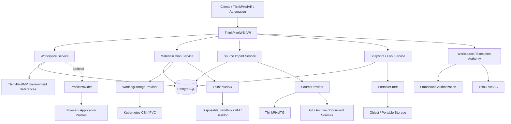

The defining architectural relationship is:

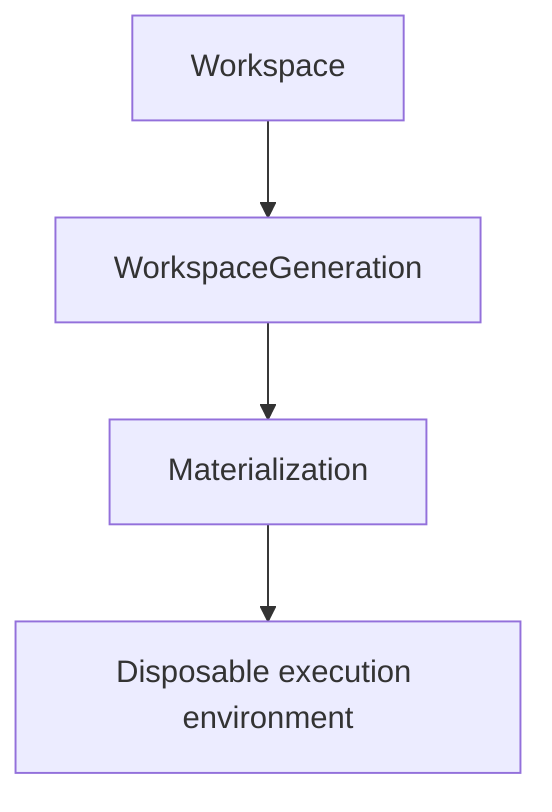

The Materialization may disappear.

The Workspace does not.

## Workspace model

### Workspace

A **Workspace** is the long-lived logical unit of work.

Examples:

```text
payments-modernization
q3-board-report
incident-2026-08-17
customer-acme-migration
```

A Workspace may outlive:

- individual users;
- agent Sessions;
- harnesses;
- Pods;
- VMs;
- nodes;
- clusters;
- execution environments.

### WorkspaceGeneration

A **WorkspaceGeneration** is an immutable committed state of the Workspace.

For example:

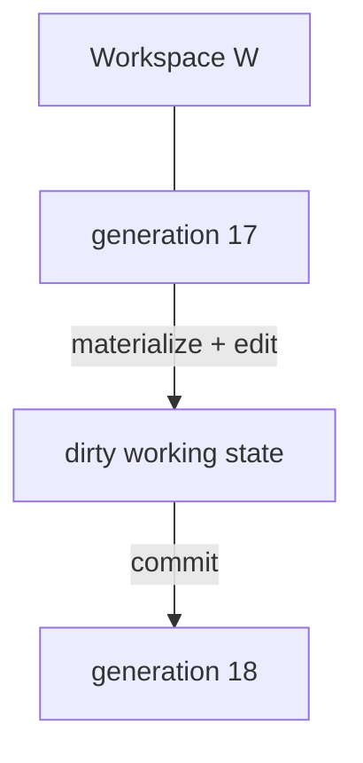

Completed generations are never silently rewritten.

This gives ThinkPixelWS reproducibility, rollback, auditability, and safe branching.

### Materialization

A **Materialization** is one concrete realization of a Workspace generation on temporary infrastructure.

It may use:

- Kubernetes PVC;
- cloned CSI volume;
- restored object-store snapshot;
- VM disk;
- future desktop/profile provider.

A Materialization contains temporary provider-specific state.

It is not the canonical Workspace identity.

### Checkpoint

A **checkpoint** is a provider-local durability point for an active Materialization.

It may be sufficient for recovering after:

- Pod failure;
- sandbox replacement;
- node loss.

It is not necessarily portable.

### PortableSnapshot

A **PortableSnapshot** is an infrastructure-independent representation of committed Workspace state.

It is intended for:

- roaming;
- archive;
- disaster recovery;
- cross-storage reconstruction.

### Fork

A **fork** creates a new Workspace identity from an immutable generation.

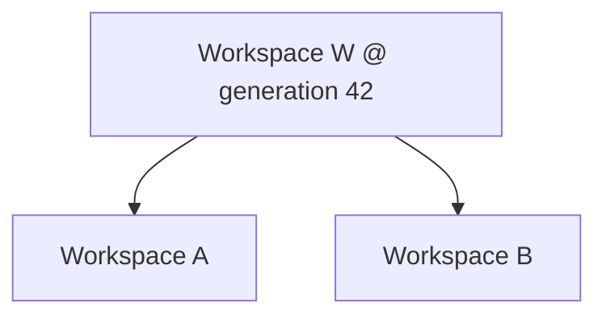

Both descendants can diverge independently.

## Multi-repository Workspaces

ThinkPixelWS does not assume one repository equals one Workspace.

A coding Workspace may contain:

```text
/workspace/
  frontend/
  backend/
  infrastructure/
  shared-protos/
  docs/
  scratch/
```

Each repository retains independent provenance such as:

```text
source repository
source revision
imported commit
import timestamp
classification
trust/taint metadata
```

The Workspace generation represents the combined point-in-time state of the work.

This allows one logical change to span several repositories without pretending they share one Git history.

## Workspace components

A Workspace is composed from typed components.

Initial component kinds include:

### Repository

Source-controlled project content.

Metadata may include:

- source URI;
- exact imported commit;
- branch/ref;
- provider;
- provenance;
- classification.

### Directory

Generic durable filesystem content.

Useful for:

- generated work;
- scratch data;
- project-specific files;
- reports.

### Document collection

A logical collection of documents imported from or associated with systems such as:

- SharePoint;
- Google Drive;
- object storage;
- file shares.

### Artifact collection

Explicit outputs produced during work.

Artifacts remain distinguishable from source content.

## External bindings

Some work context should remain external.

Examples:

```text
Slack #payments
Jira PAYMENTS
SharePoint /Projects/Payments
GitHub repository acme/payments-api
production observability dashboard
```

ThinkPixelWS represents these using `ExternalBinding`.

An ExternalBinding describes:

> This resource belongs to the work context.

It does **not** mean:

> The current agent may access this resource.

The invariant is:

```text
WorkspaceBinding != AccessGrant
```

ThinkPixelAG decides which bindings a particular Run may access.

ThinkPixelTG normally executes live external operations using downstream credentials that remain outside the Workspace.

## Source materialization

Content can enter a Workspace through a SourceProvider.

Conceptually:

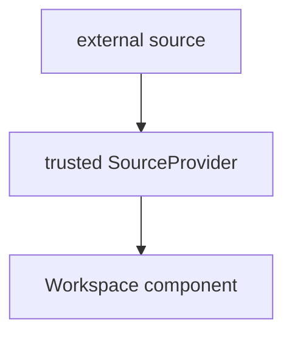

In an integrated ThinkPixel deployment:

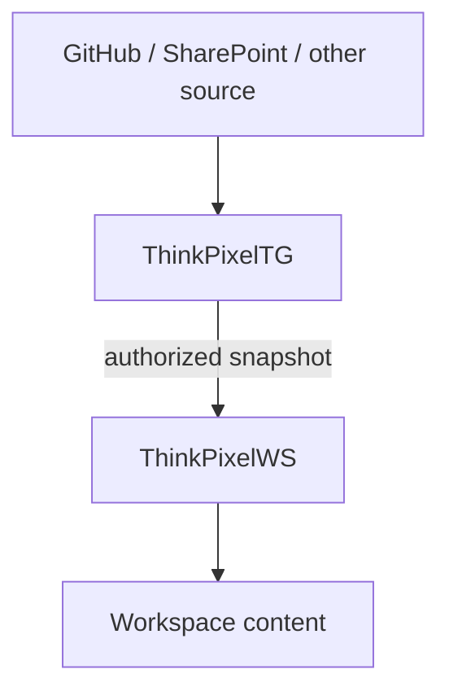

The agent receives the content.

The agent does not need the reusable source-system credential.

## Source synchronization

ThinkPixelWS deliberately separates source import from write-back.

Initial modes include:

### Snapshot

Import exact source state once.

### Refreshable snapshot

Track source identity and explicitly request a new import.

Refresh creates a new generation or fork according to conflict policy.

### Live reference

Leave the resource external and access it through a governed integration.

Automatic bidirectional synchronization is not part of the first release.

A local Workspace modification does not automatically imply permission to push, merge, send, publish, or deploy.

## Source provenance

ThinkPixelWS preserves enough information to answer:

- where did this content come from?
- which exact source revision was used?
- who requested the import?
- which Run produced a derived change?
- what classification applied?
- what trust/taint applied?

Example:

```text
component:
  backend

source:
  github/acme/payments-api

source_revision:
  72ab...

workspace_generation:
  42

imported_at:
  ...

requested_by:
  Run R123

classification:
  internal
```

Provenance is part of durable Workspace history.

## Classification and taint

Workspace content may come from different trust domains.

ThinkPixelWS can attach metadata such as:

```text
public
internal
confidential
restricted
```

and:

```text
trusted-internal
authenticated-external
external-untrusted
high-taint
```

ThinkPixelWS preserves this information.

ThinkPixelAG, ThinkPixelGR, and other trusted components may use it for policy.

## Concurrency and fencing

The default rule is:

> **One writable Materialization owns the current Workspace head at a time.**

Multiple read-only Materializations may exist concurrently.

Writable ownership uses a lease and monotonically increasing fencing token.

Example:

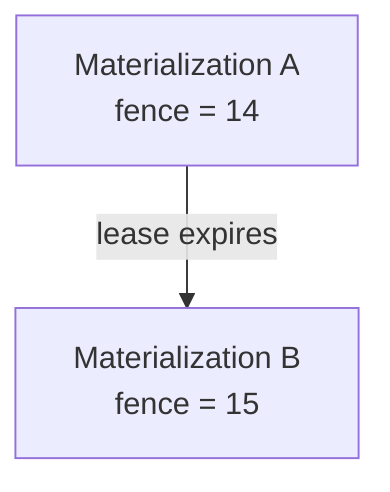

After fence 15 becomes current, Materialization A cannot:

- commit;
- advance the Workspace head;
- publish an older checkpoint as current.

This protects against stale workers and infrastructure recovery races.

Parallel experimentation should normally use forks.

## Workspace commit

A writable Materialization starts from a known generation.

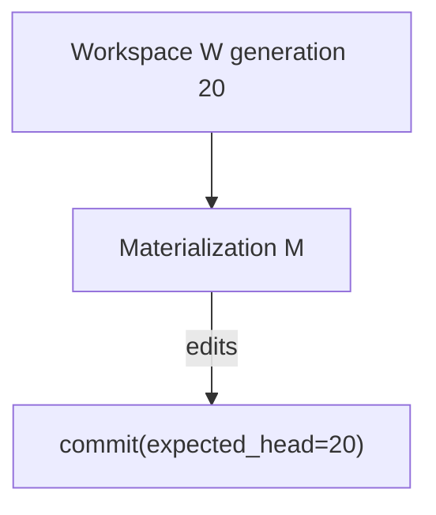

If the current head is still 20:

```text
generation 21
```

is created atomically.

If another writer already advanced the Workspace, the stale commit fails rather than silently overwriting work.

The first release should prefer explicit conflict/fork behavior over automatic merging.

## Hot storage versus portable state

ThinkPixelWS distinguishes performance-oriented working storage from canonical portable state.

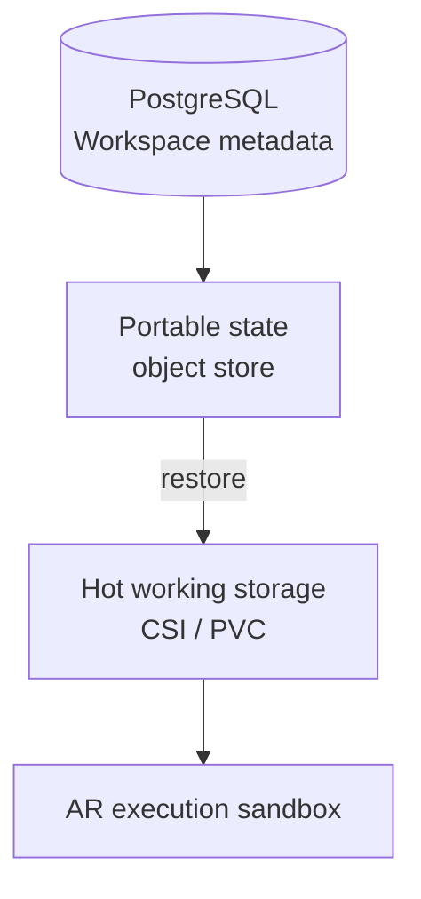

The hot volume provides low-latency POSIX access.

Portable state provides roaming, archive, and disaster recovery.

This distinction prevents a storage-provider-specific PVC from becoming the Workspace abstraction.

## Roaming

ThinkPixelWS distinguishes three concepts.

### Persistent

The work survives loss of current compute.

### Portable

The work can be reconstructed on different compatible infrastructure.

### Roaming

The same logical Workspace identity can be materialized on another permitted execution/storage target.

A PVC may be persistent but not truly roaming.

A release-candidate roaming proof should therefore demonstrate recovery without depending on the original hot volume.

## Data residency

Roaming remains policy constrained.

A Workspace may have:

```text
classification = confidential
residency = EU
```

ThinkPixelWS must not silently move that Workspace to an incompatible execution/storage target.

Placement checks may include:

- residency;
- classification;
- storage compatibility;
- encryption key availability;
- application-profile availability;
- target capabilities.

ThinkPixelWS exposes locality information but does not become the global compute scheduler.

## Environment bindings

The Workspace can reference a reproducible execution environment.

Examples:

- immutable OCI image;
- ThinkPixelMP artifact resolution;
- `devcontainer.json`;
- Devfile;
- ThinkPixelAR Runtime Profile;
- office/browser environment profile.

The environment is separate from mutable Workspace data.

Preferred model:

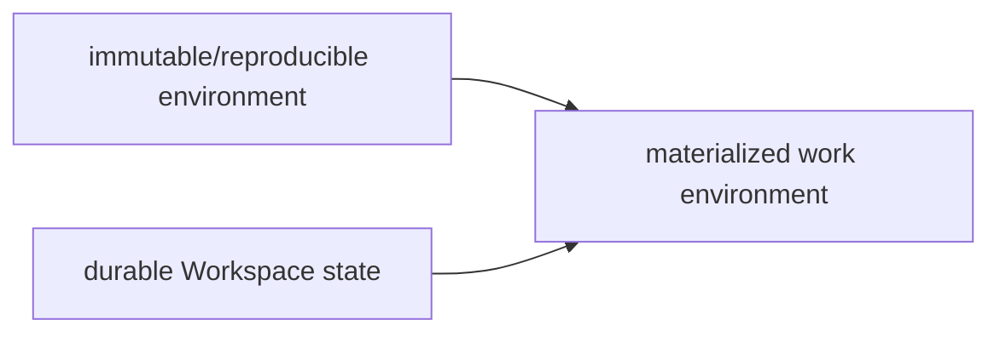

ThinkPixelWS does not directly execute the environment.

## Dev Container and Devfile interoperability

ThinkPixelWS intends to interoperate with existing development-environment standards rather than replace them.

A Dev Container or Devfile may provide useful information about:

- projects;
- components;
- tools;
- volumes;
- environment requirements.

Infrastructure-sensitive directives remain subject to trusted policy.

A Workspace definition cannot grant itself:

- privileged containers;
- host mounts;
- unrestricted network access;
- Kubernetes credentials.

## Application profiles

Application profiles represent durable application-specific state that may need to roam independently of the filesystem.

Examples:

- browser profile;
- IDE personalization;
- office-application profile;
- desktop profile.

Profiles use an explicit provider abstraction.

They are not ordinary Workspace files.

### Browser profiles

A browser profile can contain:

- cookies;
- localStorage;
- IndexedDB;
- bookmarks;
- extensions;
- authenticated sessions.

This makes browser state credential-adjacent.

The invariant is:

```text
BrowserProfileRef != BrowserAccessGrant
```

Loading a profile requires explicit authorization.

Profile state should have:

- stronger encryption;
- explicit access policy;
- dedicated audit;
- separate retention;
- secure deletion;
- no casual inclusion in generic Workspace export.

The first release may provide the abstraction without requiring a full production browser-profile implementation.

## ThinkPixelAG integration

A governed Run can reference a Workspace.

ThinkPixelAG decides:

- which Workspace;
- which generation;
- which component subset;
- read-only or writable mode;
- external binding capabilities;
- classification limits;
- resource constraints.

Example:

```text
Workspace:
  payments-modernization

contains:
  frontend
  backend
  infrastructure
  Slack #payments
```

AG may grant:

```text
read/write:
  frontend
  backend

read-only:
  infrastructure

external:
  none
```

ThinkPixelWS must not expand that grant.

## ThinkPixelAR integration

ThinkPixelAR owns:

```text
Session
Execution
Attempt
Sandbox
Harness state
```

ThinkPixelWS owns:

```text
Workspace
WorkspaceGeneration
Materialization
Checkpoint
PortableSnapshot
Fork
```

AR retains only a binding such as:

```text
workspace_id
generation
materialization_id
access_mode
provider-neutral mount handle
```

Closing an AR Session does not automatically delete the Workspace.

Destroying an AR Sandbox does not automatically destroy the Workspace.

## ThinkPixelTG integration

ThinkPixelTG provides governed external access.

Typical source-import flow:

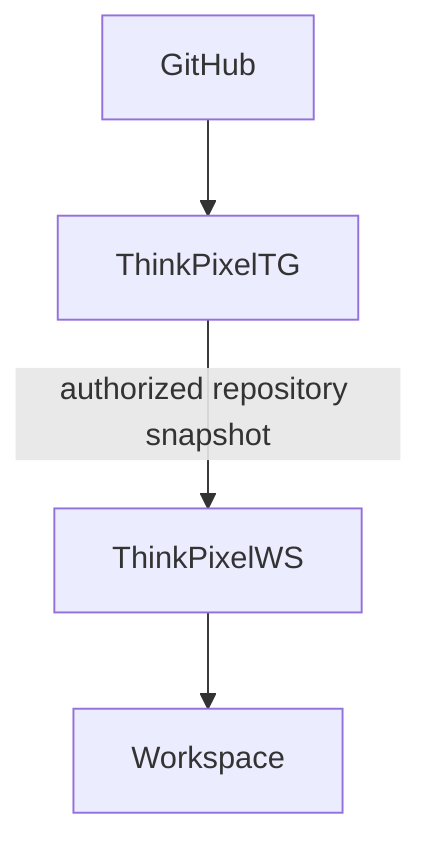

Typical write-back flow:

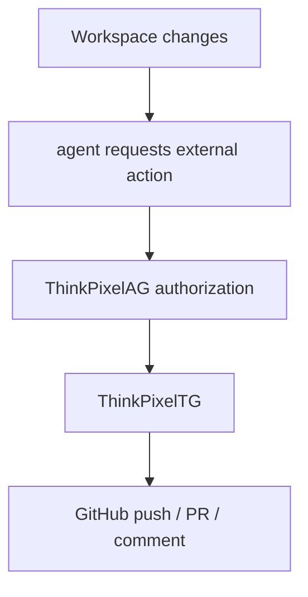

Workspace persistence itself never grants external write authority.

## ThinkPixelMP integration

ThinkPixelMP can qualify reusable Workspace-related software definitions such as:

- execution environment images;
- toolchain bundles;
- Workspace templates;
- office/browser environment packages.

ThinkPixelWS stores immutable references to those qualified artifacts.

MP qualifies the software.

WS persists the work.

AR executes it.

## Workspace Manifest

ThinkPixelWS intends to provide a portable declarative Workspace representation.

Illustrative example:

```yaml
apiVersion: workspace.thinkpixel.io/v1alpha1
kind: Workspace

metadata:
  name: payments-modernization

components:
  - name: frontend
    kind: repository
    path: /workspace/frontend
    source:
      ref: scm://github/acme/payments-ui
      mode: snapshot

  - name: backend
    kind: repository
    path: /workspace/backend
    source:
      ref: scm://github/acme/payments-api
      mode: snapshot

  - name: project-documents
    kind: document-collection
    path: /workspace/docs
    source:
      ref: documents://sharepoint/payments
      mode: snapshot

externalBindings:
  - name: team-chat
    kind: collaboration
    ref: collaboration://slack/acme/payments
    mode: live-reference

applicationProfiles:
  - name: corporate-browser
    kind: browser
    ref: profile://browser/alice/payments

environment:
  ref: mp://environments/engineering-standard@sha256:...
```

The Manifest contains references and requirements.

It does not contain credentials.

## API contract

The initial API uses REST/JSON with OpenAPI 3.1 and SSE for Workspace events.

Expected surface:

```text
POST   /v1/workspaces
GET    /v1/workspaces
GET    /v1/workspaces/{workspace_id}
DELETE /v1/workspaces/{workspace_id}

GET    /v1/workspaces/{workspace_id}/components
POST   /v1/workspaces/{workspace_id}/components

GET    /v1/workspaces/{workspace_id}/generations
GET    /v1/workspaces/{workspace_id}/generations/{generation}

POST   /v1/workspaces/{workspace_id}/materializations
GET    /v1/materializations/{materialization_id}
POST   /v1/materializations/{materialization_id}/checkpoint
POST   /v1/materializations/{materialization_id}/commit
DELETE /v1/materializations/{materialization_id}

POST   /v1/workspaces/{workspace_id}/snapshots
POST   /v1/workspaces/{workspace_id}/forks

POST   /v1/workspaces/{workspace_id}/imports
POST   /v1/workspaces/{workspace_id}/refreshes

POST   /v1/workspaces/{workspace_id}/archive
POST   /v1/workspaces/{workspace_id}/restore

GET    /v1/workspaces/{workspace_id}/events
```

Mutation APIs support scoped `Idempotency-Key` semantics.

Errors use RFC 7807 problem details.

## Persistence

PostgreSQL is authoritative for control metadata including:

- Workspaces;
- generations;
- components;
- source bindings;
- external bindings;
- profile references;
- environment bindings;
- provenance;
- classification and taint;
- Materializations;
- leases and fences;
- checkpoints;
- portable snapshot metadata;
- forks;
- retention;
- audit;
- idempotency;
- transactional outbox.

Large Workspace content lives in storage providers, not PostgreSQL.

## Storage-provider architecture

ThinkPixelWS intentionally avoids one overly broad storage abstraction.

Expected provider boundaries include:

### WorkingStorageProvider

High-performance writable Materializations.

Initial target:

```text
Kubernetes CSI / PVC
```

### SnapshotProvider

Provider-native checkpoints/snapshots.

### PortableStore

Infrastructure-independent portable state.

### SourceProvider

External content import.

### ProfileProvider

Credential-adjacent application-profile state.

This separation allows storage technology to evolve without changing the Workspace domain.

## Encryption

Enterprise Workspace state must support encryption at rest.

Portable snapshots require explicit encryption semantics when state may leave the original storage domain.

A KeyProvider abstraction should support external KMS/HSM systems.

Raw encryption keys must not be stored in:

- PostgreSQL;
- logs;
- Workspace Manifests;
- events.

## Credential persistence

ThinkPixelWS cannot prevent users or agents from manually writing a secret into an ordinary file.

However, the platform must avoid causing credential persistence.

Execution credentials should be mounted outside Workspace paths.

Known platform credential directories should be excluded from Workspace snapshots.

Optional secret-scanning hooks may detect likely accidental persistence.

ThinkPixelWS is not itself a credential store.

## Retention, archive, and deletion

Workspace lifecycle is explicit.

Policies may include:

- idle TTL;
- archive after inactivity;
- generation retention;
- snapshot retention;
- legal hold;
- delete-after;
- profile retention.

Archive may release expensive hot storage while retaining portable canonical state.

Deleting a Workspace does not imply deleting data in authoritative external systems merely referenced by that Workspace.

## Security model

Assume hostile:

- imported repositories;
- documents;
- archives;
- filenames;
- symlinks;
- generated files;
- source metadata;
- compromised agents;
- compromised Materializations;
- application-profile content.

ThinkPixelWS must defend against:

- path traversal;
- absolute-path escape;
- symlink/hardlink escape;
- cross-component path collision;
- special-device creation;
- stale writer commits;
- tenant enumeration;
- cross-tenant snapshot restoration;
- credential residue;
- unauthorized profile access;
- prohibited cross-region roaming;
- Workspace metadata attempting to grant infrastructure privilege.

## Security principles

- Workspace identity is logical, not provider-specific.
- Completed generations are immutable.
- Stale writers are fenced.
- Membership is not authority.
- Source import is not source write-back.
- Credentials are not canonical Workspace state.
- Application profiles receive stronger protection than normal files.
- External bindings carry references, not reusable credentials.
- Roaming obeys residency/classification policy.
- Environment metadata cannot grant runtime privilege.
- Portable state is integrity checked.
- Provider-specific state remains behind adapters.
- Work can outlive every machine used to manipulate it.

## Repository layout

The planned repository layout is:

```text
cmd/
  thinkpixelws/
  migrate/
  thinkpixelwsctl/

api/
  openapi/
  schemas/

internal/
  domain/
    workspace/
    generation/
    component/
    materialization/
    snapshot/
    fork/
    provenance/

  app/
    workspace/
    materialization/
    checkpoint/
    commit/
    import/
    roaming/
    lifecycle/

  ports/
    authorization/
    workingstorage/
    snapshot/
    portable/
    source/
    profile/
    key/
    policy/
    clock/

  adapters/
    authorization/
      local/
      thinkpixelag/

    workingstorage/
      kubernetes/

    snapshot/
      csi/

    portable/
      objectstore/

    source/
      archive/
      git/
      thinkpixeltg/

    profile/
      browser/

    policy/
      opa/

    postgres/
    http/
    oidc/
    key/

  telemetry/
  security/

migrations/

deploy/
  helm/

docs/
  adr/
  contracts/
  supported-versions.md

test/
  integration/
  storage/
  security/
  e2e/
  roaming/
  chaos/

Dockerfile
Makefile
PLAN.md
TODO.md
```

The core dependency rule is:

> `internal/domain` must not import Kubernetes, CSI, S3 SDKs, GitHub APIs, browser-provider SDKs, ThinkPixelAG/TG transport types, PostgreSQL drivers, or HTTP framework types.

Those are adapters.

## Development workflow

The root Makefile is the stable developer/CI interface.

Expected targets include:

```text
make generate
make fmt
make lint
make test
make test-race
make test-integration
make test-storage
make test-security
make test-roaming
make test-e2e
make verify
make build
make image
```

## Testing strategy

ThinkPixelWS is primarily a persistence, concurrency, and portability system.

Testing therefore treats storage failure and stale writers as first-class cases.

The release suite includes:

- unit tests;
- race tests;
- property/fuzz tests;
- real PostgreSQL tests;
- Kubernetes/CSI integration tests;
- snapshot tests;
- portable restore tests;
- multi-repository tests;
- fork isolation tests;
- stale-writer tests;
- path/archive security tests;
- AG/AR/TG integration tests;
- residency tests;
- credential-residue tests;
- chaos tests.

A hostile Workspace fixture should attempt:

```text
../../../etc/passwd
absolute paths
symlink escape
hardlink escape
component path collision
credential persistence
privileged runtime metadata
cross-tenant snapshot references
```

The expected result is infrastructure rejection or safe containment.

## Reference MVP scenario

A coding Workspace contains:

```text
frontend/
backend/
infrastructure/
```

Each repository is imported at an exact source commit.

An AG-governed AR Execution receives write access to `frontend` and `backend`.

ThinkPixelWS materializes the Workspace into isolated compute.

The agent modifies both repositories and commits Workspace generation 18.

The Sandbox and hot working environment are destroyed.

Later:

```text
Workspace W
generation 18
```

is restored onto replacement infrastructure.

The exact combined work state returns.

The Workspace is then forked:

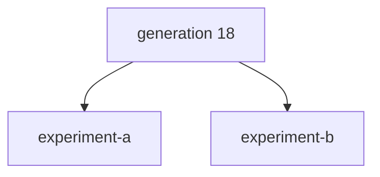

The two forks diverge independently.

No reusable GitHub credential or stale execution token is carried as part of the Workspace.

## Release-candidate definition

ThinkPixelWS reaches release-candidate state when:

- Workspace identity is independent of physical storage/compute;
- multi-repository Workspaces work end to end;
- immutable generations are enforced;
- one-writer fencing is proven;
- stale writers cannot commit;
- provider-local checkpoints work;
- portable snapshots work;
- the original hot volume can be destroyed;
- the Workspace can be reconstructed on a different compatible target;
- forks diverge independently;
- source provenance survives generations and forks;
- AG-scoped component access is enforced;
- AR uses provider-neutral WorkspaceBinding;
- source-system credentials remain outside canonical Workspace state;
- path/archive security tests pass;
- residency policy is enforced;
- production install/upgrade/backup/restore procedures pass;
- required `TODO.md` items are complete.

The defining RC proof is:

> **A durable multi-component work context can be materialized into disposable compute, modified under bounded authority, committed into an immutable generation, reconstructed on different compatible infrastructure, and forked independently without carrying stale execution authority or coupling Workspace identity to any machine, volume, agent Session, or cloud.**

## Roadmap after the first release

Potential post-RC work includes:

- additional storage providers;
- VM/cloud-workstation materializations;
- Windows desktop/profile integration;
- production browser-profile providers;
- richer office-work environments;
- Workspace templates;
- ThinkPixelMP-distributed templates;
- richer Dev Container/Devfile interoperability;
- Git-aware multi-repository change sets;
- governed bidirectional synchronization;
- additional portable snapshot backends;
- incremental cross-region replication;
- Workspace locality optimization;
- DLP integrations;
- richer legal-hold/data-governance integrations;
- human/agent handoff workflows;
- cross-enterprise Workspace sharing.

These extensions must preserve the core rule:

> **The Workspace persists. The execution surface is replaceable.**

## License

Licensed under the terms in `LICENSE`.
