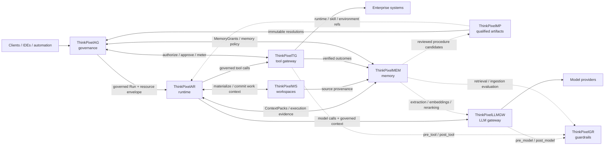

# ThinkPixelWS

ThinkPixelWS is an open-source, vendor-neutral Workspace Service for durable, portable, and roaming AI-agent work contexts.

> **Work persists. Compute moves.**

A Workspace is durable logical context, independent of any Pod, VM, PVC, cluster, cloud, agent harness, or Session. It can contain multi-repository work, documents, generated artifacts, source provenance, and references to external resources or reproducible environments. Immutable generations can be materialized into disposable execution environments, checkpointed, committed, forked, archived, and restored.

The primary security invariant is:

> **Workspace membership describes context. It does not grant runtime authority.**

ThinkPixelWS keeps runtime authority, source-system credentials, model access, agent execution, long-term memory, and software qualification outside the Workspace boundary. The repository's precise role in the platform is documented in [`ALIGNMENT.md`](ALIGNMENT.md).

## Status

The normative Phase 0 architecture, security model, ADRs, provider contracts, OpenAPI 3.1 contract, and machine-readable Workspace/portable-snapshot schemas are complete. Service implementation has not started; [`TODO.md`](TODO.md) is the ordered release-candidate ledger.

The first implementation milestone targets a Go control plane, PostgreSQL authoritative metadata, Kubernetes CSI-backed Materializations, one-writer leases and fencing, portable snapshots, forks, source provenance, and ThinkPixelAR integration.

## Key concepts

- **Workspace** — the long-lived, tenant-scoped logical unit of work.
- **WorkspaceGeneration** — an immutable committed Workspace state.
- **Materialization** — a disposable provider realization of one generation.
- **Checkpoint** — provider-local recovery state; not necessarily portable or committed.
- **PortableSnapshot** — encrypted, provider-independent committed content used for archive, recovery, and roaming.
- **Fork** — a new Workspace identity derived from an immutable generation.

See the [normative architecture](docs/architecture.md) and [documentation index](docs/README.md) for the complete model.

## Development

Requirements are Go 1.25.14, Python 3, Node.js/npm, and Git. The Go module
also declares the exact supported toolchain for automatic selection by the Go command.

Run the aggregate repository gate:

```sh
make help
make verify
```

This runs formatting, vet, lint, unit, race, vulnerability, license, build, and
contract validation. See [`PLAN.md`](PLAN.md) for implementation intent and
[`docs/phase-0-evidence.md`](docs/phase-0-evidence.md) for the Phase 0 evidence.

The repository-root Makefile is the stable developer entry point. Use
`make generate` after changing generated inputs, `make check` for fast source and
contract checks, and `make verify` for the aggregate repository gate. Run
`make help` for the independently runnable checks.

## Documentation

- [Platform role and ownership boundary](ALIGNMENT.md)
- [Implementation plan](PLAN.md)
- [Release-candidate ledger](TODO.md)
- [Architecture](docs/architecture.md)
- [Security model](docs/security.md)
- [Enterprise integration contracts](docs/enterprise-integration.md)
- [API and schemas](docs/contracts/)
- [Accepted architecture decisions](docs/adr/)
- [Operations and compatibility](docs/operations.md)

## ThinkPixel platform

This project is part of the **ThinkPixel** family: a modular, vendor-neutral set of components for building governed enterprise AI-agent platforms.

Each component is independently useful. The complete platform is a composition of replaceable services connected through versioned contracts; no component requires the full stack in order to be deployed.

| Component | Role |
|---|---|
| [ThinkPixelAG](https://github.com/bdobrica/ThinkPixelAG) | Agent governance and lifecycle control plane: agent/run authority, policy decisions, resource envelopes, approvals, revocation, and trusted governance state. |
| [ThinkPixelAR](https://github.com/bdobrica/ThinkPixelAR) | Agent runtime: durable Sessions, isolated/disposable execution, harness adaptation, recovery, and runtime events. |
| [ThinkPixelWS](https://github.com/bdobrica/ThinkPixelWS) | Durable roaming Workspaces: persistent work context, immutable generations, materializations, snapshots, forks, and source provenance. |
| [ThinkPixelMEM](https://github.com/bdobrica/ThinkPixelMEM) | Long-term agent memory: governed learned context, provenance, temporal revisions, retrieval, correction, and forgetting. |
| [ThinkPixelMP](https://github.com/bdobrica/ThinkPixelMP) | Marketplace and software supply-chain plane for Skills, runtimes, MCP servers, agent bundles, and other immutable agentic artifacts. |
| [ThinkPixelTG](https://github.com/bdobrica/ThinkPixelTG) | Tool gateway and policy-enforcement point for governed tool calls, downstream credentials, side effects, idempotency, and tool evidence. |
| [ThinkPixelLLMGW](https://github.com/bdobrica/ThinkPixelLLMGW) | LLM gateway for provider abstraction, model routing, credentials, budgets, accounting, and model-access policy enforcement. |
| [ThinkPixelGR](https://github.com/bdobrica/ThinkPixelGR) | Guardrails evaluator for model, tool, retrieval, and ingestion content. It returns findings/decisions; the calling gateway or service enforces them. |

### Intended composition



The diagram describes the **target integration model**, not a claim that every edge is implemented in every current release.

### Integration rules

The platform follows a few cross-component rules:

- **Authority does not emerge from content.** Marketplace metadata, Skills, Workspace membership, retrieved memory, model output, or a guardrail `allow` decision cannot grant permissions that the governed Run does not already have.
- **State has one authoritative owner.** Components exchange references and versioned messages; they do not read or write another component's database directly.
- **Integrations are adapters, not domain dependencies.** A ThinkPixel integration should be configurable and replaceable with a contract-compatible alternative.
- **Cross-component identity is explicit.** Where relevant, requests should carry stable governed context such as tenant, principal, agent, Run, Session/Workspace references, immutable artifact digests, and trace context.
- **Public integration contracts are versioned.** OpenAPI/JSON Schema/protobuf or another explicit wire contract is preferred over importing another repository's internal types.
- **Vendor-specific behavior stays behind adapters.** Model providers, agent harnesses, storage systems, registries, policy engines, and execution substrates must not become platform-wide domain contracts.

### Planned integration points

| Integration | Intended contract |
|---|---|
| **AG → AR** | AG admits a Run and supplies its authority/resource context; AR executes it and must not enlarge that authority. Revocation, lease, and fencing state flow back into runtime enforcement. |
| **MP → AG / AR / WS** | MP resolves qualified artifacts to immutable identities/digests. AG decides whether they may be used; AR/WS consume the resolved runtime, Skill, or environment references. Qualification is not authorization. |
| **AR ↔ WS** | AR materializes a durable Workspace generation into disposable execution and returns committed/checkpointed work to WS. Session identity remains owned by AR; Workspace identity remains owned by WS. |
| **AR → LLMGW** | Agent model calls go through LLMGW with governed Run/tenant context. Provider credentials and provider-specific routing stay outside the harness. |
| **LLMGW ↔ GR** | LLMGW will support an optional configured GR endpoint/profile mapping. It invokes `pre_model` before provider dispatch and `post_model` before releasing model output, then enforces GR's decision/transformation. GR remains optional and replaceable; its wire API is the contract. |
| **AR → TG** | Harness tool calls cross TG rather than reaching governed enterprise systems directly. TG owns credential brokerage, idempotency/side-effect handling, and trusted tool evidence. |
| **TG ↔ AG** | TG asks AG (or a contract-compatible authorizer) whether the current governed Run may perform the exact operation and obtains action-scoped approval when required. TG returns trusted metering/evidence. |
| **TG ↔ GR** | TG invokes `pre_tool` and `post_tool` evaluation when configured and enforces the result. A GR allow never overrides an AG authorization denial. |
| **AR / WS / TG → MEM** | Execution history, Workspace provenance, and verified tool outcomes may become evidence for learned memory. MEM does not become the source of truth for those upstream systems. |
| **AG ↔ MEM** | AG supplies Run-scoped memory authority (for example MemoryGrants); MEM enforces it for reads/writes and returns structured ContextPacks. |
| **MEM ↔ LLMGW / GR** | MEM may use LLMGW for extraction/embedding/reranking and GR for ingestion/retrieval inspection while keeping canonical memory state independent from either service. |
| **MEM → MP** | Learned procedure candidates may be reviewed and promoted through MP into qualified reusable Skills; learning does not silently become trusted executable behavior. |

Project-specific implementation status, supported versions, and release qualification belong in each project's own documentation.

## License

Licensed under the terms in [LICENSE](LICENSE).
