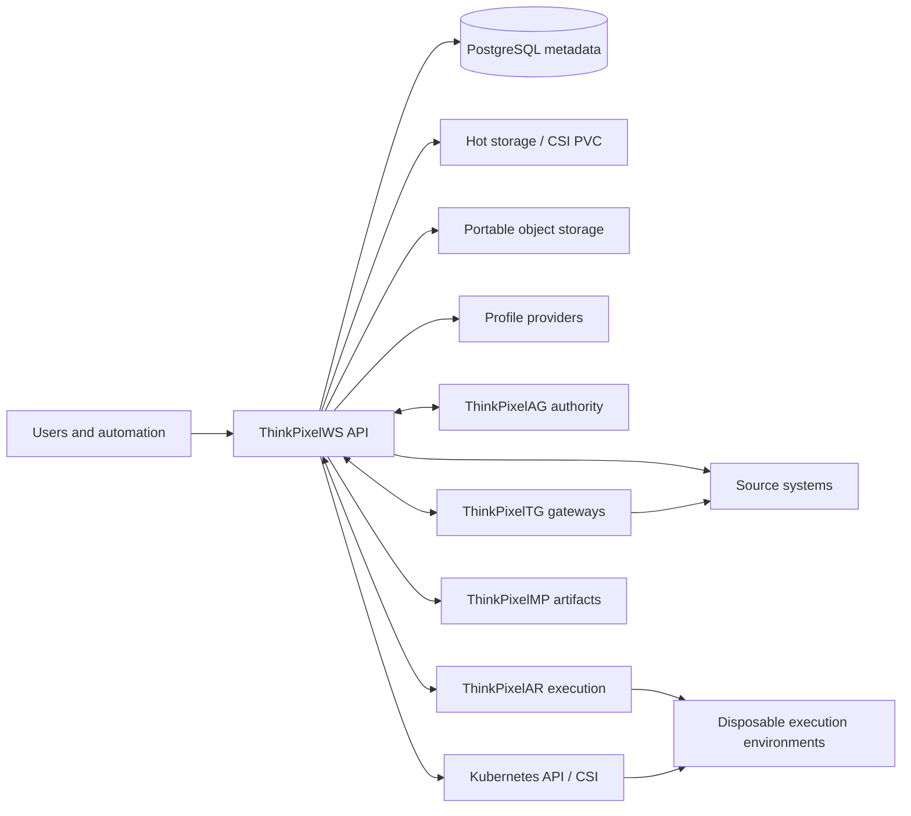
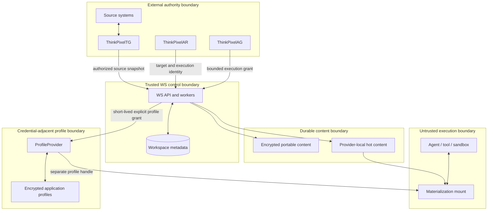
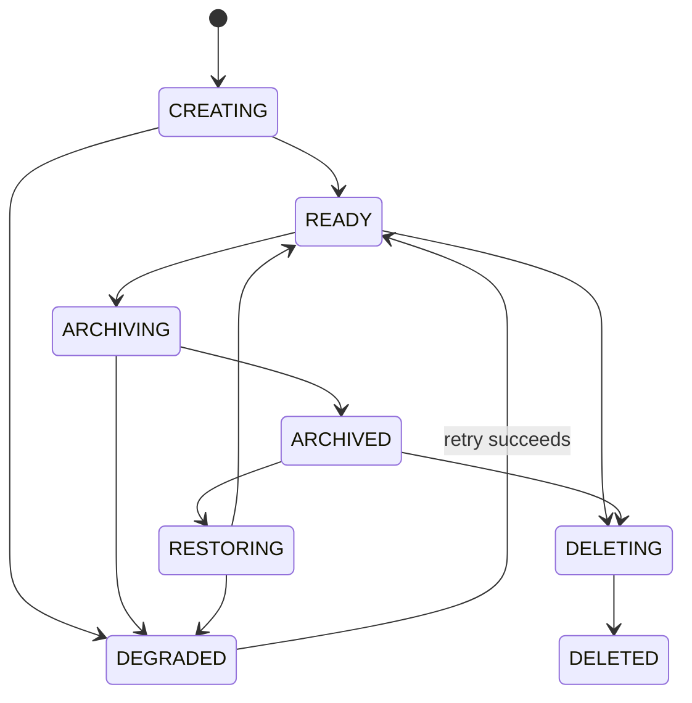
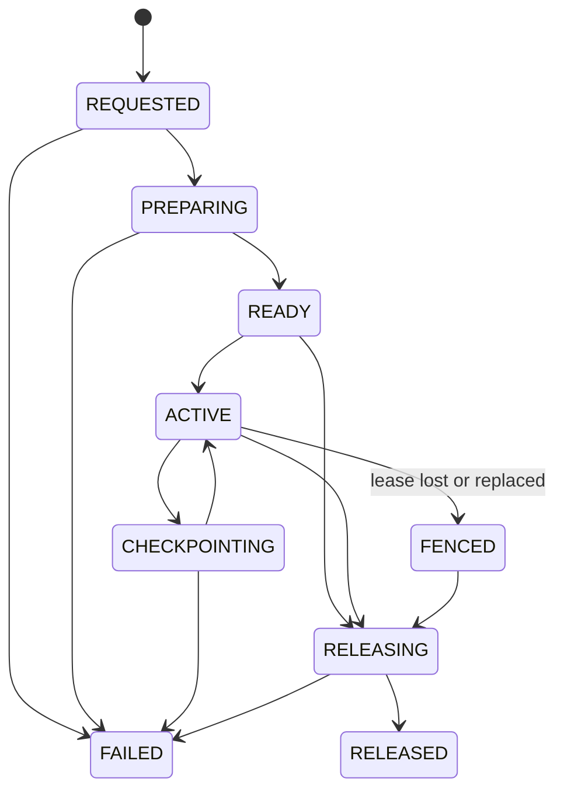

# Normative architecture

## System context

## Trust boundaries

Arrows show data/control flows, not inherited trust. Data crossing a boundary is authenticated, authorized, bounded, validated, and audited.

## Normative glossary

| Term | Definition |
|---|---|
| Workspace | Long-lived, tenant-scoped logical identity for durable work context and bindings. It is independent of compute and storage-provider identity. |
| WorkspaceGeneration | Immutable, committed logical state of a Workspace, numbered monotonically within that Workspace. |
| WorkspaceComponent | Named unit in a generation with a deterministic `/workspace/<name>` path or a non-filesystem binding. |
| Materialization | Disposable provider realization of one generation, optionally writable under a lease and fence. |
| Checkpoint | Provider-local durability point for an active Materialization; useful for recovery but not necessarily portable or committed. |
| PortableSnapshot | Encrypted provider-independent representation capable of reconstructing a committed generation. |
| Fork | New Workspace identity initialized from an immutable source generation with recorded lineage. |
| SourceBinding | Reference and acquisition mode for content originating in an external source. |
| ExternalBinding | Context reference to data/service that remains external; it conveys no access grant. |
| ApplicationProfileBinding | Reference to credential-adjacent application state managed separately by a ProfileProvider. |
| EnvironmentBinding | Reference to a reproducible execution-environment definition or qualified artifact; it conveys no runtime privilege. |
| ArtifactBinding | Reference to generated or imported artifacts, including immutable digest, media type, provenance, and classification. |
| WorkspaceBinding | AR-facing reference to a Workspace, generation/component subset, mode, and opaque Materialization handle. |
| AccessGrant | Independently issued, bounded authorization for a principal/Run to perform named operations. |

## Non-negotiable invariants

1. `Workspace != Materialization`.
2. `Workspace != ThinkPixelAR Session`.
3. `WorkspaceBinding != AccessGrant`.
4. Workspace canonical content MUST NOT intentionally contain platform execution credentials.
5. Completed WorkspaceGenerations MUST NOT be mutated or renumbered.
6. Source import MUST NOT imply source-system write-back.
7. A stale or expired writer MUST NOT checkpoint authoritatively or commit.
8. Infrastructure metadata MUST NOT directly grant host or Kubernetes privilege.
9. Sensitive profiles MUST NOT be copied, forked, or exported without an explicit grant and policy decision.
10. Classified data MUST NOT move outside allowed residency.

## Persistence, portability, and roaming

- **Persistent:** survives replacement of current compute while its storage domain remains available.
- **Portable:** can be reconstructed on another compatible provider from a self-describing format.
- **Roaming:** the same Workspace identity and generation are materialized in another authorized execution/storage location from portable state, without dependency on the original hot volume.

A PVC proves persistence only. A verified encrypted portable snapshot proves portability. A successful authorized reconstruction on an independent target proves roaming.

## State machines

Deleted, released, failed, and fenced are terminal for their resource instance. Recovery creates a new operation or Materialization; it does not rewrite history.

## Generations, commits, and concurrency

A writable Materialization records `base_generation`, `lease_id`, and `fencing_token`. Acquiring a writer uses a serializable transaction that expires/rejects any current lease and increments `workspace.writer_fence`. Default lease duration is 60 seconds; holders renew every 20 seconds with jitter. Server time is authoritative.

Commit validates, in one transaction:

1. tenant, principal, grant, Workspace, and Materialization match;
2. lease is active, unexpired, and owned by the Materialization;
3. supplied fence equals both the lease fence and Workspace writer fence;
4. `expected_head_generation` equals current Workspace head;
5. all component snapshot references and digests are complete;
6. classification/residency and secret-scan policy allow commit/export.

It then inserts generation `head + 1`, immutable component/provenance rows, audit and outbox records, advances head, and marks the Materialization clean. Any failure rolls back. Read-only Materializations never acquire leases and may coexist without limit subject to quota.

## Component and path model

Filesystem kinds are `repository`, `directory`, `document-collection`, and `artifact-collection`. Binding kinds are `external`, `application-profile`, and `environment`. Component names are 1–63 characters matching `^[a-z][a-z0-9-]*[a-z0-9]$` (a single letter is allowed). Their path is exactly `/workspace/<name>` unless a future manifest version changes the rule.

Before comparison, paths are UTF-8 validated, Unicode NFC normalized, slash normalized, and case folded. Empty/dot segments, `..`, absolute input paths, NUL, Windows drive/UNC forms, reserved device names, control characters, and symlink-resolved escape are rejected. No component roots may be equal, ancestor/descendant, or collision-equivalent. Mounts are created by trusted code, not copied from environment metadata.

## Bindings and source modes

- `snapshot`: resolve and import one immutable source revision; never refresh automatically.
- `refreshable-snapshot`: retain source identity; an explicit authorized refresh produces a generation or fork.
- `live-reference`: content remains external and requires a current external capability at use time.

Artifact bindings use immutable digests. External bindings support `live-reference` or `materialized-copy`; the latter becomes a content component with provenance. Profiles always use `profile-reference`. Environment references must resolve to immutable artifacts before generation commit.

## Durability matrix

| Object | Mutable | Survives sandbox | Survives hot-store loss | Portable | Advances head |
|---|---:|---:|---:|---:|---:|
| Dirty Materialization | yes | provider-dependent | no | no | no |
| Provider checkpoint | no | yes | provider-dependent | no | no |
| WorkspaceGeneration metadata | no | yes | yes | metadata only | yes |
| PortableSnapshot | no | yes | yes, with object store/KMS | yes | no |

A generation commit guarantees authoritative logical metadata and verified referenced state. The RC API reports durability as `provider-local` or `portable`; operators may require portable durability before acknowledging selected commits.

## Fork semantics

A fork creates a new Workspace and generation 1 from a completed source generation. It preserves component bytes, provenance, classification/taints, source and immutable environment references, and parent lineage. It receives a new writer fence and no leases, grants, Materializations, idempotency records, or audit identity. Profile references are omitted by default; an explicit authorized policy may copy only a reference, never authenticated profile bytes as ordinary content.
